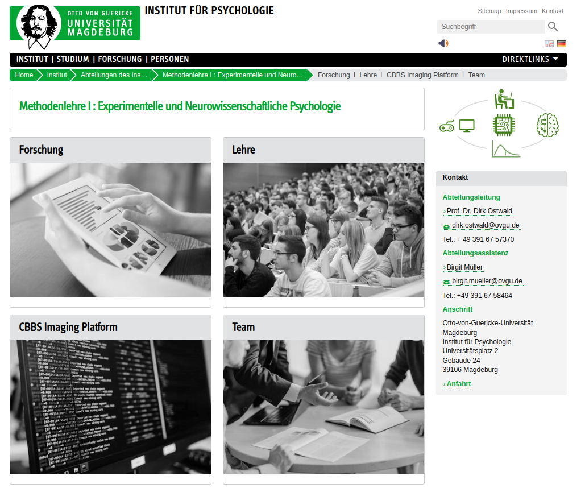
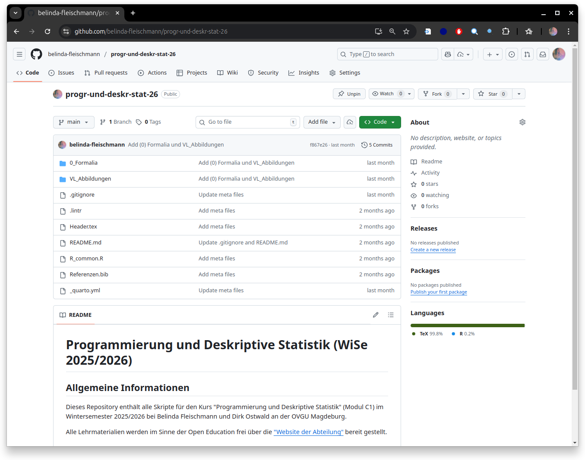
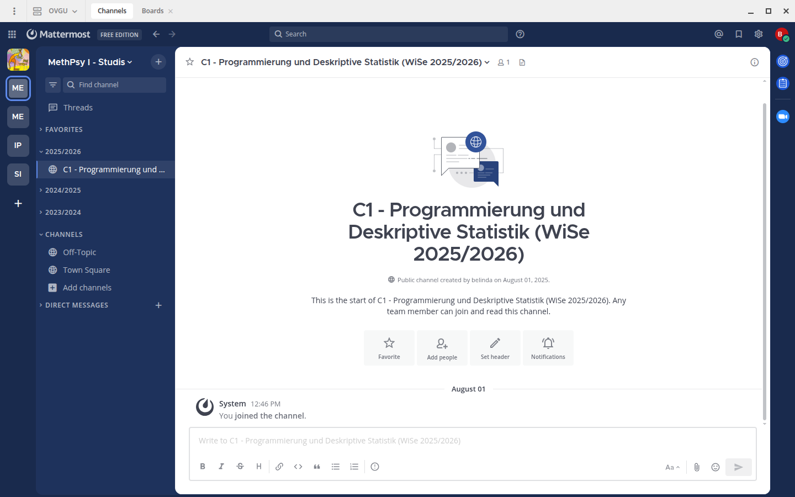
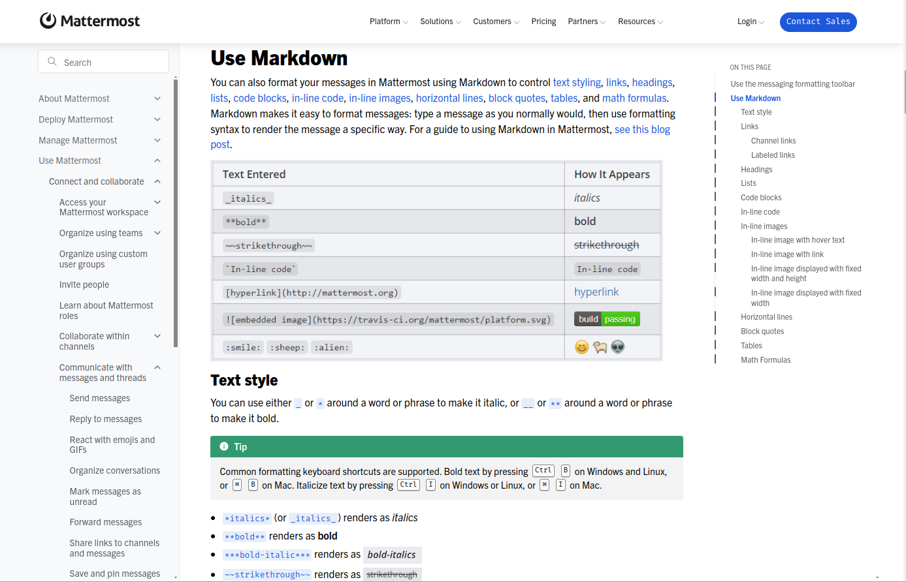

# Titelfolie {.plain}
\center
{width="20%"}

\vspace{2mm}

\Large
Programmierung und Deskriptive Statistik
\vspace{4mm}

\normalsize
BSc Psychologie WiSe 2025/26

\vspace{15mm}
\normalsize
Belinda Fleischmann und Dirk Ostwald

# Herzlich Willkommen!{.plain} 
\huge
\center
\vfill
Herzlich willkommen!
\vfill

# Aufnahme läuft {.plain}
\huge
\vfill

\vspace{3mm}
\center
Aufnahme läuft.
{width="8%"}

\vfill

# (0) Formalia - Titelfolie {.plain}
\vfill
\center
\huge
\textcolor{black}{(0) Formalia}
\vfill

# Lehrstuhlwebsite
\vspace{5mm}

[\textcolor{linkblue}{Homepage der Abteilung für Methodenlehre I}](https://www.ipsy.ovgu.de/methodenlehre_I-path-980,1404.html)

{width="80%"}

# Modul C: Einführung in empirisch-wissenschaftliches Arbeiten
\setstretch{2}
\textcolor{darkblue}{C1. Programmierung und Deskriptive Statistik}

* Einführung in die datenanalytische Programmierung
* Einführung in die Auswertung deskriptiver Statistiken mit R in Visual Studio Code

\vspace{3mm}

\textcolor{darkblue}{C2. Analyse und Dokumentation}

* Praktische Analyse empirischer Daten
* Dokumentation empirischer Studien und Analysen

# Inhalte in C1 - Programmierung und Deskriptive Statistik
\setstretch{1.3}

\textcolor{darkblue}{Programmierung}

\begin{itemize}  \justifying
\item Einführung in die Programmiersprache R und die Entwicklungsumgebung Visual Studio Code (VS Code).
\item Grundlegende Konzepte der datenanalytischen Programmierung in R, einschließlich arithmetischer Operationen, logischer Operationen, Variablen, Datenstrukturen und Kontrollstrukturen.
\item Einführung in wesentliche Werkzeuge und Pakete für die Durchführung deskriptiver statistischer Analysen mit R.
\end{itemize}
\normalsize

\vspace{3mm}

\textcolor{darkblue}{Deskriptive Statistik}

\begin{itemize}  \justifying 
\item Grundlegende Methoden der deskriptiven Statistik zur Analyse und Beschreibung quantitativer Daten.
\item Praktische Übung anhand von Anwendungsbeispielen.
\end{itemize}

# Struktur in C1 - Programmierung und Deskriptive Statistik
\setstretch{1.3}

\textcolor{darkblue}{Seminarbestandteile}

\begin{itemize} \justifying
\item \textbf{Seminare}: Theoretische und praktische Einführung in die wesentlichen Konzepte der Programmierung und deskriptiven Statistik.
\item \textbf{Übung}: Anwendung der erlernten Konzepte in von Studierenden geleiteten Präsenzübungen (Gruppenarbeit) mit Hilfestellung der Lehrpersonen.
\item \textbf{Individualleistung}: Schriftliche Abgabe der Programmierübungen in einem R Skript.
\end{itemize}

\textcolor{darkblue}{Vor- und Nachbereitung}

\begin{itemize}  \justifying 
\item Zur erfolgreichen Teilnahme ist eine regelmäßige Vor- und Nachbereitung der Programmierübungen und Selbstkontrollfragen erforderlich (entsprechend dem \textcolor{linkblue}{\href{https://www.bekanntmachungen.ovgu.de/media/Modulhandbücher/Bachelor+_+Studiengänge/Psychologie/Modulhandbuch+B_Sc_+Psychologie+24_11_2021-p-17076.pdf}{Modulhandbuch}} mit durchschnittlich 6,5 Stunden Lernzeit pro Woche).
\item Die Computerplätze am URZ stehen außerhalb der Belegzeiten (siehe \textcolor{linkblue}{\href{https://lsf.ovgu.de/qislsf/rds?state=wplan&act=Raum&pool=Raum&show=plan&P.vx=mittel&raum.rgid=176}{G26.1-006}} oder \textcolor{linkblue}{\href{https://lsf.ovgu.de/qislsf/rds?state=wplan&act=Raum&pool=Raum&show=plan&P.vx=mittel&raum.rgid=177}{G26.1 007}}) zur freien Nutzung zur Verfügung. 
\end{itemize}

# Struktur in C1 - Programmierung und Deskriptive Statistik
\setstretch{1.3}

\textcolor{darkblue}{Gruppenarbeit}

\begin{itemize} \justifying
\item Konzeption und Durchführung studierendengeleiteter Praxiseinheiten zu ausgewählten Themenschwerpunkten in Kleingruppen (3-4 Studierende).
\item Gruppenbildung und Themenverteilung erfolgt über Moodle.
\item Aufbau einer studierendengleiteten Präsenzübungen.
\begin{itemize} \small
\item Wiederholung der relevanter Konzepte der Programmierung bzw. Deskripten Statistik und Vorstellung der Übungsaufgaben (15 min).
\item Freie Bearbeitungszeit der Aufgaben durch alle Seminarteilnehmer:innen (65 min).
\item Tutorieller Unterstützung durch Mitglieder der Präsentationsgruppe.
\item Vorstellung des erarbeiteten R Codes (10 min).
\item Gleichmäßig verteilte Präsentationszeit der Gruppenmitglieder.
\end{itemize}
\end{itemize}

# Struktur in C1 - Programmierung und Deskriptive Statistik
\setstretch{1.3}

\textcolor{darkblue}{Individualleistung}

\begin{itemize}  \justifying
\item Individuelle Bearbeitung von Programmieraufgaben mit Abgabe der Lösungen als kommentierte R-Skripte.
\item Die Invidualleistung besteht aus zwei Teilen.
\item Ein Teil der Invididualleistung gilt als erbracht, wenn mind. 50 \% der Aufgaben richtig gelöst wurden.
\end{itemize}

\vfill

\textcolor{darkblue}{Das Tutorium dient der Unterstützung bei der Vorbereitung der Präsenzübung und der Bearbeitung des Leistungsnachweises!}

# Organisatorisches
\setstretch{1.5}
\small

\begin{itemize}
\item \textbf{Gruppe 1:}  
Mittwochs, 13-15 Uhr (G26.1-007, Persönlicher Laptop optional)
\item \textbf{Gruppe 2:}  
Mittwochs, 15-17 Uhr (G26.1-007, Persönlicher Laptop optional)
\item \textbf{Gruppe 3:}  
Donnerstags, 9-11 Uhr (G40B-226, Persönlicher Laptop notwendig)
\item Tutorien (zweiwöchentlich): Organisation über die \textcolor{linkblue}{\href{https://elearning.ovgu.de/course/view.php?id=19888}{Moodleseite des Tutoriums}}
\item Kursmaterialien (Folien, Videos, Übungsblätter) auf der \textcolor{linkblue}{\href{https://www.ipsy.ovgu.de/Institut/Abteilungen+des+Institutes/Methodenlehre+I/Lehre/Wintersemester+2026/Programmierung+und+Deskriptive+Statistik.html}{Kurswebseite}}
\item Code auf \textcolor{linkblue}{\href{https://github.com/belinda-fleischmann/progr-und-deskr-stat-26}{Github}}
\item Ankündigungen, Gruppeneinteilung und Abgabe der Individualleistung über die \textcolor{linkblue}{\href{https://elearning.ovgu.de/course/view.php?id=19714}{Moodleseite}}
\item Vorherige Iteration des Kurses: \textcolor{linkblue}{\href{https://www.ipsy.ovgu.de/Institut/Abteilungen+des+Institutes/Methodenlehre+I/Lehre/Wintersemester+2025/Programmierung+und+Deskriptive+Statistik.html}{Programmierung und Deskriptive Statistik (WiSe 2024/25)}}
\item Forum für Studierende im \textcolor{linkblue}{\href{https://mm.cs.ovgu.de/bsc-psychologie-2023/channels/20252026}{Mattermost-Channel}}
(Einmalige \textcolor{linkblue}{\href{https://mm.cs.ovgu.de/signup_user_complete/?id=jycatiwir3bw3mtximamm5i1qy&md=link&sbr=su}{Registrierung}})
\item Modulklausur am Ende des Sommersemesters 2026 gemäß Prüfungsplan des \textcolor{linkblue}{\href{https://www.fnw.ovgu.de/Studium/Prüfungsamt.html}{FNW Prüfungsamtes}}
\end{itemize}

# Termine Gruppe 1 und 2
\setstretch{1.3}
\vfill
\center
\small
\renewcommand{\arraystretch}{1.1}

\begin{tabular}{lllll}
  & Gruppe 1/2  & Gruppe 3    & Format  & Thema                                                \\ \hline
1  & Mi, 15.10. & Do, 16.10.  & Seminar & (1) Grundlagen der Informatik                        \\
2  & Mi, 22.10. & Do, 23.10.  & Seminar & (2) Arithmetik und Variablen                         \\
3  & Mi, 29.10. & Do, 30.10.  & Übung   & (2) Arithmetik und Variablen                         \\
4  & Mi, 05.11. & Do, 06.11.  & Seminar & (3) Vektoren und Matrizen                            \\
5  & Mi, 12.11. & Do, 13.11.  & Übung   & (3) Vektoren und Matrizen                            \\ \hline
6  & Mi, 19.11. & Do, 20.11.  & Seminar & (4) Listen und Dataframes                            \\
7  & Mi, 26.11. & Do, 27.11.  & Übung   & (4) Listen und Dataframes                            \\
8  & Mi, 03.12. & Do, 04.12.  & Seminar & (5) Datenmanagement                                  \\
9  & Mi, 10.12. & Do, 11.12.  & Übung   & (5) Datenmanagement                                  \\
   & Mo, 15.12  &             & Abgabe  & \textit{Individualleistung (1/2)}                    \\
10 & Mi, 17.12. & Do, 18.12.  & Seminar & (6) Strukturiertes Progr.: Kontrollfluss, Debugging  \\
11 & Mi, 07.01. & Do, 08.01.  & Seminar & (7) Häufigkeitsverteilungen                          \\
12 & Mi, 14.01. & Do, 15.01.  & Übung   & (7) Häufigkeitsverteilungen                          \\
13 & Mi, 21.01. & Do, 22.01.  & Seminar & (8) Maße der zentralen Tendenz und Datenvariabilität \\
14 & Mi, 28.01. & Do, 29.01.  & Übung   & (8) Maße der zentralen Tendenz und Datenvariabilität \\ 
   & Mo, 02.02  &             & Abgabe  &\textit{Individualleistung (2/2)}                     \\ \hline
\end{tabular}

\vfill

# GitHub
\vspace{5mm}

[\textcolor{linkblue}{Git-repository des Kurses (Code und Folien)}](https://github.com/belinda-fleischmann/progr-und-deskr-stat-26)

\vfill 

{width="80%"}

# Mattermost
\vspace{5mm}

{width="80%"}

\small

* Regristierung und Beitritt zum **Team** \textcolor{linkblue}{\href{https://mm.cs.ovgu.de/signup_user_complete/?id=jycatiwir3bw3mtximamm5i1qy&md=link&sbr=su}{MethPsy I - Studis}}.
* Beitritt zum **Channel** [\textcolor{linkblue}{C1 - Programmierung und Deskriptive Statistik (WiSe 2025/2026)
}](https://mm.cs.ovgu.de/bsc-psychologie-2023/channels/20252026)
* Zugang über [\textcolor{linkblue}{Web-App}](https://mm.cs.ovgu.de/bsc-psychologie-2023/channels/c1---programmierung-und-deskriptive-statistik-wise-20242025) (gleicher Link wie oben), [\textcolor{linkblue}{Desktop-App}](https://mattermost.com/download/?utm_source=google&utm_medium=cpc&utm_campaign=Google_Brand_EMEA&utm_term=mattermost%20install&utm_placement=&gad_source=1&gclid=Cj0KCQjw5ea1BhC6ARIsAEOG5pxQje4p0Qf9uPehjTg9tXPIces15h-YimpVOJ-Uoe1doLKw3jgUKzsaAuU-EALw_wcB#desktop) oder [\textcolor{linkblue}{Mobile App}](https://mattermost.com/download/?utm_source=google&utm_medium=cpc&utm_campaign=Google_Brand_EMEA&utm_term=mattermost%20install&utm_placement=&gad_source=1&gclid=Cj0KCQjw5ea1BhC6ARIsAEOG5pxQje4p0Qf9uPehjTg9tXPIces15h-YimpVOJ-Uoe1doLKw3jgUKzsaAuU-EALw_wcB#mobile) möglich.

# Tipps zur Nutzung des Mattermost-Forums

**Forum als Community-Tool**

\begin{small}
Wenn Sie Fragen haben, die auch für andere relevant sein könnten, stellen Sie diese bitte im Forum. Prüfen Sie zuvor, ob eine ähnliche Frage bereits existiert, um Dopplungen zu vermeiden und den Austausch zu fördern. Beantworten Sie auch gerne Fragen anderer Studierender. Etwas zu erklären, ist oft der beste Weg, das eigene Verständnis zu vertiefen.
\end{small}

**Präzise und spezifisch formulieren**

\begin{small}
Formulieren Sie Ihre Fragen bitte möglichst konkret. Anstelle von „Ich verstehe Thema X nicht.“ fragen Sie zum Beispiel: „Ist im dritten Punkt zum Thema X gemeint, dass...?“. Präzise Fragen ermöglichen klare Antworten und helfen Ihnen bereits beim Formulieren, das Thema besser zu durchdringen. Oft klären sich Fragen dabei von selbst.
\end{small}

**Kontext angeben**

\begin{small}
Verweisen Sie bitte immer auf das Thema, die Foliennummer oder die konkrete Übungsaufgabe. Idealerweise direkt mit der Verlinkungsfunktion in Mattermost. So können Fragen schneller im richtigen Zusammenhang verstanden und beantwortet werden.
\end{small}

# Tipps zur Nutzung des Mattermost-Forums

Verwenden Sie [\textcolor{linkblue}{Markdown in Mattermost}](https://docs.mattermost.com/collaborate/format-messages.html), um Ihre Beiträge übersichtlich zu strukturieren und wichtige Inhalte hervorzuheben.

\vfill

{width="85%" fig-align="center"}

#  
\vfill
\Huge
\center
Q & A
\vfill
