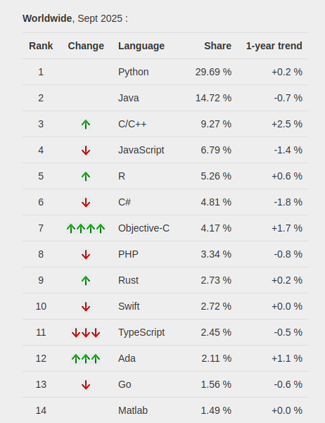
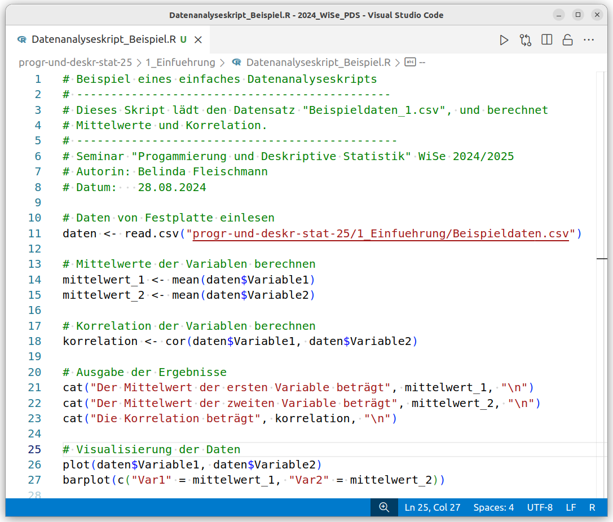
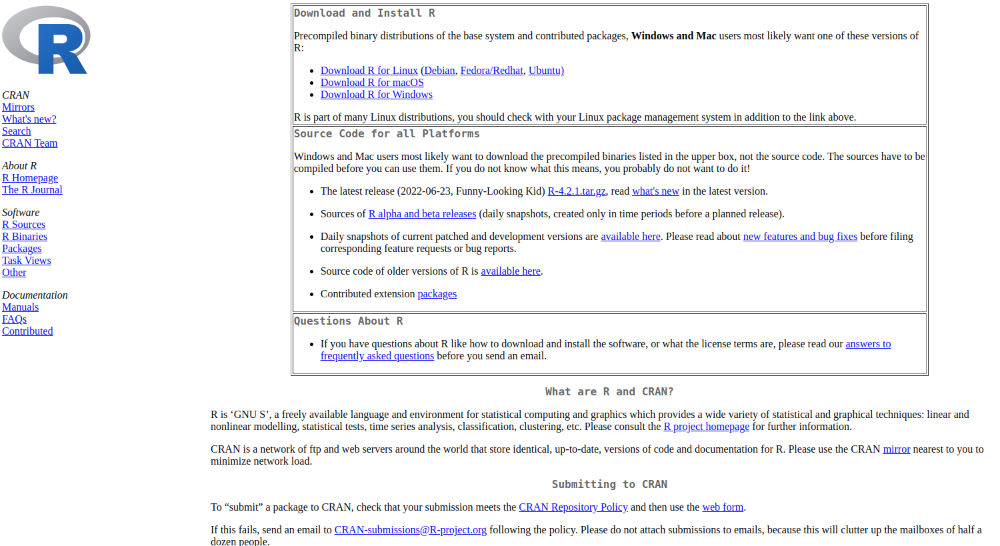
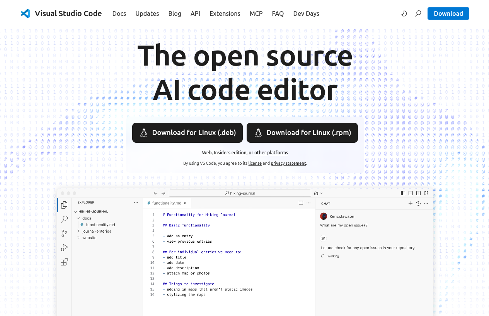
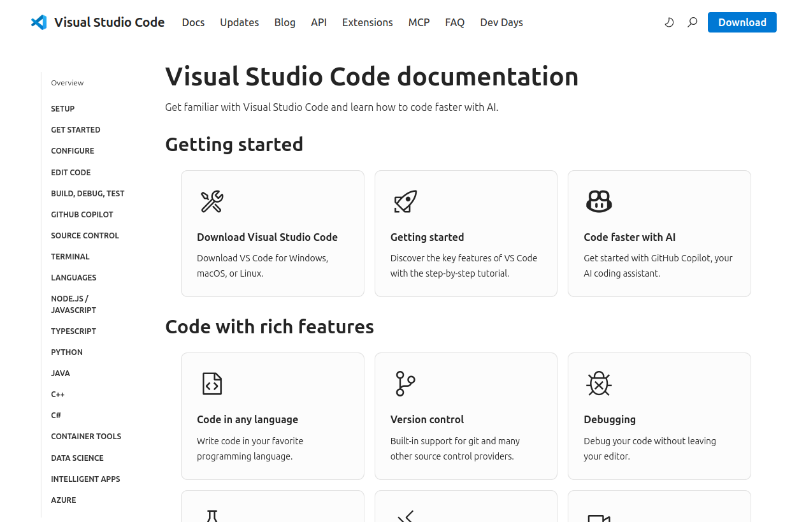
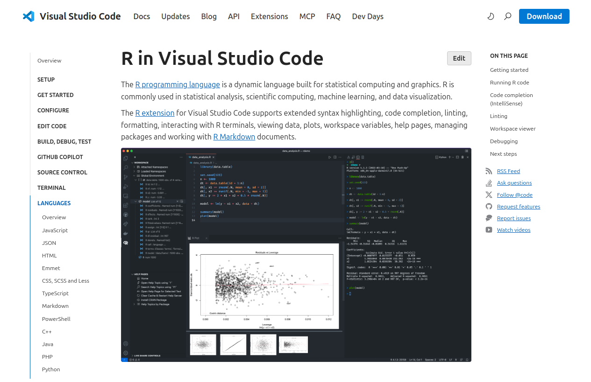

# Titelfolie {.plain}
\center
{width="20%"}

\vspace{2mm}

\Large
Programmierung und Deskriptive Statistik
\vspace{4mm}

\normalsize
BSc Psychologie WiSe 2025/26

\vspace{15mm}
\normalsize
Belinda Fleischmann und Dirk Ostwald


# (1) Grundbegriffe der Informatik - Titelfolie {.plain}
\vfill
\center
\huge
\textcolor{black}{(1) Grundbegriffe der Informatik}
\vfill


# AGENDA {.plain}
\large
\setstretch{2.5}
\vfill

Datenanalyse

Informatik

Rechnerarchitektur

Algorithmen und Programme

R und Visual Studio Code

Aufgaben


# Datenanalyse --------------------------------------------------------{.plain}
\AtBeginSubsection{}
\subsection{Datenanalyse}
\setstretch{2.5}
\vfill
\large

**Datenanalyse**

Informatik

Rechnerarchitektur

Algorithmen und Programme

R und Visual Studio Code

Aufgaben


# Datenwissenschaft
\vspace{5mm}

\large
\textcolor{darkblue}{Zentrale Komponenten der Datenwissenschaft}

{width="85%" fig-align="center"}


# Datenanalyse -  Überblick
\setstretch{3}

* Wissenschaftliche Daten liegen heutzutage als digitale Daten vor. 
* Digitale Daten werden mit Hilfe eines Computers analysiert.
* Zur Analyse von digitalen Daten schreibt man Computerprogramme.
* Diese Computerprogramme heißen Datenanalyseskripte.


# Struktur computergestützter Datenanalyse
\setstretch{3}

1. Einlesen und Bereinigen eines digitalen Datensatzes.
2. Berechnung und Visualisierung deskriptiver Statistiken.
3. Probabilistische Modellierung und Inferenz.
4. Dokumentation und Präsentation der Ergebnisse.


# Werkzeuge der Datenanalyse
\setstretch{2}

\large
Typische Werkzeuge zur Analyse psychologischer Daten

\normalsize
* [\textcolor{linkblue}{R}](https://www.r-project.org/) (frei, Datenwissenschaft, Statistik, Psychologie)
* [\textcolor{linkblue}{Python}](https://www.python.org/psf/) (frei, Datenwissenschaft, Anwendung)
* [\textcolor{linkblue}{Matlab}](https://de.mathworks.com/) (kommerziell, Engineering, Neuroimaging)

\vspace{3mm}

\large
Altmodisch

\normalsize
* [\textcolor{linkblue}{SPSS}](https://www.ibm.com/de-de/analytics/spss-statistics-software) (kommerziell, Sozialwissenschaften, Psychologie)
* [\textcolor{linkblue}{JMP}](https://www.jmp.com/de_de/home.html) (kommerziell, Biologie, Psychologie)
* [\textcolor{linkblue}{STATA}](https://www.stata.com/) (kommerziell, Wirtschaftswissenschaften)


# Programmiersprachen Trends
\vspace{2mm}

[\textcolor{linkblue}{PYPL Index}](https://pypl.github.io/PYPL.html) (Stand: September 2025)

{width="40%" fig-align="left"}

* PopularitY of Programming Language
* Basierend auf Googlesuchanfragen zu Programmiersprachentutorials


# Datenanalyseskripte
\setstretch{3}

* Dokumentation aller Schritte von Rohdaten bis zur Datenvisualisierung.
* Reproduktion wissenschaftlicher Ergebnisse durch Dritte.
* Essentieller Teil wissenschaftlicher Publikationen.
* Essentieller Teil täglicher wissenschaftlicher Arbeit.


# Datenanalyseskripte

\textcolor{darkblue}{Beispiel}

```{r, echo = F, eval = F}
# Set the random seed for reproducibility
set.seed(123)


# Add some random noise to the second variable
variable1 <- rnorm(50, mean = 50, sd = 15)

# Generate noise from a normal distribution
noise <- rnorm(50, mean = 0, sd = 15)

# Define correlation between the variables
correlation <- 0.50

# Adjust the second variable to achieve the desired correlation
variable2 <- correlation * variable1 + sqrt(1 - correlation^2) * noise

cor(variable1, variable2)

# Round the variables to 2 decimal positions
variable1 <- round(variable1, 2)
variable2 <- round(variable2, 2)

# Create a data frame to store the variables
data <- data.frame(Variable1 = variable1, Variable2 = variable2)

# Save the dataset to a CSV file
data_dir <- file.path("..", "Daten")
# Output-Ordner für Abbildungen erstellen, falls nicht existent
if (!file.exists(data_dir)) {                                # Prüfen, ob das Abbildungsverzeichnis existiert
  dir.create(data_dir)                                       # Verzeichnis erstellen, falls es nicht existiert
}

write.csv(data, file = file.path(data_dir, "Beispieldaten.csv"), row.names = FALSE)
```

{width="70%" fig-align="center"}


# Datenanalyseskripte

\textcolor{darkblue}{Intuition zur Struktur der Computergestützten Datenanalyse}

\vspace{-2mm}

{width="105%" fig-align="left"}

# Datenanalyse - Zusammenfassung
\setstretch{3}

* Die Digitalisierung betrifft insbesondere auch die Wissenschaft.
* Forschungsdatenmanagement ist eine akute Herausforderung.
* Programmierung als zentrales Handwerkszeug wissenschaftlicher Arbeit.
* Informatikkenntnisse sind in der Arbeitswelt unverzichtbar.
* Dies gilt auch für Psychotherapeut:innen (z.B. Online-Intervention).


# Informatik ----------------------------------------------------------{.plain}
\AtBeginSubsection{}
\subsection{Informatik}

\setstretch{2.5}
\vfill
\large

Datenanalyse

**Informatik**

Rechnerarchitektur

Algorithmen und Programme

R und Visual Studio Code

Aufgaben


# Begriff
\vfill
\large

Informatik (engl. Computer Science)

\vspace{2mm}

\normalsize
\justifying
Nach allgemeinem Sprachgebrauch (vgl. Wikipedia) handelt es sich bei der Informatik um die Wissenschaft der systematischen Darstellung, Speicherung, Verarbeitung und Übertragung von Informationen, wobei besonders die automatische Informationsverarbeitung mit Computern betrachtet wird. Die Informatik ist dabei zugleich Grundlagen- und Formalwissenschaft als auch Ingenieurdisziplin


\flushright{\textit{Wikipedia}}
\vfill


# Zentrale Komponenten der Informatik
\setstretch{1.3}

\large
Computer

\normalsize
* Maschinen zum Datenspeichern und Ausführen einfacher Datenoperationen.
* Einfache Operationen mit extrem hoher Geschwindigkeit.
* Universalität durch Speicherung von Daten und Programmen.

\vspace{3mm}

\large
Algorithmen und Programme

\normalsize
* *Programme* sind in einer *Programmiersprache* verfasste *Algorithmen*.
* Algorithmen sind Folgen von Anweisungen durchzuführender Operationen.
* Bei Algorithmen unterscheidet man verschiedene Ebenen:
    * Beschreibung (Kochrezept, IKEA Bauanleitung, R Skript)
    * Anweisungen ("Mehl und Wasser vermengen", o - - -,  x = c(1,2,3))
    * Durchführung (Kochvorgang, Zusammenbau, R Skript laufen lassen)


# Teilgebiete der Informatik
\vfill

{width="85%" fig-align="center"}

\footnotesize
\flushright{\textit{Hattenhauer (2020) Informatik}}


# Teilgebiete der Informatik \textcolor{darkgreen}{mit Relevanz für die Psychologie}
\setstretch{1.5}
\vfill

Technische Informatik

* Mikroprozessortechnik, Rechnerarchitektur, Netzwerktechnik

\vspace{3mm}

Theoretische Informatik

* Automatentheorie, Berechenbarkeitstheorie, Komplexitätstheorie
\vfill

Praktische Informatik

* \textcolor{darkgreen}{Programmierung}, \textcolor{darkgreen}{Algorithmen}, Datenbanken

\vspace{3mm}

Angewandte Informatik

* Anwendungssoftware, \textcolor{darkgreen}{Human-Computer-Interaction}, Informatik und Gesellschaft

\vspace{3mm}


# Spezialgebiete der Informatik mit Relevanz für die Psychologie
\setstretch{1.5}
\vfill

Maschinelles Lernen und Künstliche Intelligenz

* Automatisierte Analyse großer Datenmengen und Generierung von Vorhersagen

\vspace{3mm}

Computervisualistik

* Bilderkennung und Bildsynthese, Virtual Reality, Augmented Reality
* Psychologische Experimente, Therapien und Trainings
\vspace{3mm}

Computerlinguistik

* Spracherkennung und Sprachsynthese
* Chatbots und Assistenzsysteme

Bioinformatik

* Genomik, Bildgebende Verfahren der Medizin
* Methoden für neuropsychologische Forschung und Diagnostik


# Rechnerarchitektur --------------------------------------------------{.plain}
\AtBeginSubsection{}
\subsection{Rechnerarchitektur}

\setstretch{2.5}
\vfill
\large

Datenanalyse

Informatik

**Rechnerarchitektur**

Algorithmen und Programme

R und Visual Studio Code

Aufgaben


# Hardwarekomponenten eines Computers
\vfill
\large

**EVA-Prinzip**: Eingabe $\to$ Verarbeitung $\to$ Ausgabe

\vfill

{width="60%" fig-align="center"}

\footnotesize
\flushright{\textit{Hattenhauer (2020) Informatik}}


# Zentraleinheit eines Computers

Die Zentraleinheit, auch Hauptplatine, Motherboard oder Mainboard genannt, ist die zentrale Leiterplatte, auf der alle wichtigen Bauteile wie Prozessor, Speicher und Anschlüsse miteinander verbunden sind.

\vfill

{width="50%" fig-align="center"}

\footnotesize
\flushright{\textit{Hattenhauer (2020) Informatik}}


# Zentraleinheit eines Computers
\setstretch{1.2}

CPU (Central Processing Unit/Mikroprozessor)

* Rechenwerk, Steuerwerk, und Leitwerk des Systems
* Berechnungen, Steuerung von Datenfluss und Koordination von Abläufen
* Cache (flüchtiger schneller Speicher)
* Intel Core iX, AMD’s Ryzen oder Apple Silicon MX Prozessoren

\vspace{2mm}
RAM (Random Access Memory)

* Temporärer, flüchtiger Arbeitsspeicher (aktuell benötigte Programme und Daten)
* Begrenzt auf bspw. 16 GB oder 32 GB

\vspace{2mm}
Massenspeicher

* Stationärer Speicher des Systems
* SSD (Solid State Drive), Cloudspeicher

\vspace{2mm}
GPU (Graphical Processing Unit)

* Leistungsstarke, speziell für Visualisierung optimierte Prozessoren
* Unterstützung der CPU in grafik- oder rechenintensiven Anwendungen, z.b. Training neuronaler Netze


# Von Neumann-Architektur
\setstretch{1.5}

Grundlage der funktionalen Architektur moderner Computer.

Rechner: Steuerwerk, Rechenwerk, Speicher, Eingabewerk, Ausgabewerk.

\normalsize
Zentrale Eigenschaften

\begin{small}
\begin{itemize}
\item Befehle und Daten werden als Binärzahlen im selben Speicher abgelegt, wodurch Programme während der Ausführung dynamisch verändert oder neu erzeugt werden können.
\item Der Speicher ist in gleichgroße nummerierte (adressierte) Zellen unterteilt, deren Inhalt über die Adresse gezielt abgerufen und verändert werden kann.
\item Ein Programm ist eine Reihe von aufeinanderfolgenden Befehlen, die in benachbarten Speicherzellen liegen und vom Steuerwerk durch einfaches Erhöhen der Befehlsadresse um eins nacheinander aufgerufen werden.
\end{itemize}
\end{small}

\center
\textbf{ $\to$ Diese Architektur eines Rechners impliziert das Grundprinzip der imperativen Programmierung:
Befehle werden streng sequentiell abgearbeitet.}

\vfill
\vfill
\small
\flushright
@vonneumann1945


# Von Neumann-Architektur
\setstretch{1.5}

\normalsize
Zentrale Eigenschaften (fortgeführt)

\begin{small}
\begin{itemize}
\item Spezielle Sprungbefehle ermöglichen es, von dieser festen Reihenfolge abzuweichen und an eine andere Stelle im Programm zu springen.
\item Grundlegende Befehle umfassen arithmetische Operationen (Addition, Multiplikation), logische Operationen (UND, ODER) sowie Transportbefehle (z.B. Übertragung von Daten vom Eingabewerk in den Speicher oder vom Speicher ins Rechenwerk).
\item Sämtliche Informationen (Befehle, Daten, Adressen) werden binär codiert. Enkodierung und Dekodierung erfolgt durch Schaltungstechnik im Rechner.
\end{itemize}
\end{small}

\small
\flushright
@vonneumann1945


# Algorithmen und Programme -------------------------------------------{.plain}
\AtBeginSubsection{}
\subsection{Algorithmen und Programme}

\setstretch{2.5}
\vfill
\large

Datenanalyse

Informatik

Rechnerarchitektur

**Algorithmen und Programme**

R und Visual Studio Code

Aufgaben


# Vom Realweltproblem zum Programm
\setstretch{1.3}

Realweltproblem

* Das Problem, das mithilfe eines Computers gelöst werden soll.
* z.B. Auswertung von Fragebogendaten einer psychologischen Studie.

\vspace{3mm}
Problemspezifikation

* Genaue sprachliche Fassung des Realweltproblems.
* z.B. Methodenteil einer wissenschaftlichen Publikation.

\vspace{3mm}
Algorithmus

* Folge von Anweisungen zur Lösung des Problems.
* z.B. Dateneinlesen, deskriptive Statistiken berechnen, T-Test durchführen.

\vspace{3mm}
Programm

* Ein Algorithmus, der von einem Computer ausgeführt werden kann.
* Eine in einer Programmiersprache verfasste Textdatei.


# Algorithmus
\small

\begin{definition}[Algorithmus]
\justifying
Ein \textit{Algorithmus} ist eine Folge von Anweisungen, um aus gewissen Eingabedaten 
bestimmte Ausgabedaten herzuleiten, wobei folgende Bedingungen erfüllt sein müssen

\begin{itemize}
\item \textit{Finitheit.} Die Anweisungsfolge muss in einem endlichen Text vollständig beschrieben sein.
\item \textit{Effektivität.} Jede Anweisung muss tatsächlich ausführbar sein.
\item \textit{Terminierung.} Der Algorithmus endet nach endlich vielen Anweisungen.
\item \textit{Determiniertheit.} Der Ablauf des Algorithmus ist zu jedem Punkt fest vorgeschrieben.
\end{itemize}

Wenn $E$ die Menge der zulässigen Eingabedaten und $A$ die Menge der zulässigen 
Ausgabedaten bezeichnet, dann ist ein Algorithmus eine Funktion
\begin{equation}
f : E \to A, e \mapsto f(e)
\end{equation}
Umgekehrt heißen Funktionen, die durch einen Algorithmus beschrieben werden 
können, \textit{berechenbare Funktionen}.
\end{definition}

\footnotesize
Bemerkung

* Effektivität sollte nicht mit Effizienz verwechselt werden.


# Programmiersprachen
\setstretch{2}
Eine Programmiersprache 

* ... bestimmt die Regeln, denen ein Programm gehorchen muss.
* ... definiert eine Syntax, also Vokabular und Programmaufbau.
* ... definiert Semantik, also die Bedeutung der erlaubten Anweisungen.

\vfill

{width="50%" fig-align="center"}


# Programmiersprachen
\setstretch{1.5}
Maschinensprache

* Elementare Operationsbefehle (z.B. Speichern, Vergleichen, Addieren)
* Elementare Operationsbefehle werden als Binärzahlen kodiert

\begin{center}
\begin{tabular}{ll}
Addiere Inhalt R1 zu Inhalt R2 	& $\Rightarrow$ 1001 0010 \\
Erhöhe Inhalt R1 um 1  			& $\Rightarrow$ 1001 0110 \\
Übertrage Inhalt R1 nach R3    	& $\Rightarrow$ 0010 0011
\end{tabular}
\end{center}


* Programme in Maschinensprache heißen *Maschinenprogramme*.
* De facto führt ein Computer nur Maschinenprogramme aus.
* Für Menschen ist die Programmierung in Maschinensprache mühselig.

\vspace{3mm}
Höhere Programmiersprache

* An die menschliche Sprache angelehnte Wörter und Sätze
* Interpreter oder Compiler übersetzen Programme in Maschinensprache
* FORTRAN, COBOL, C++, Java, Python, R, u.v.m.


# Generationen von Programmiersprachen

\normalsize
1. Generation (1GL)

\small

* Maschinensprachen
* 10110000 01100001 (hexadezimaler Darstellung des Ausdrucks "B0 61")

\normalsize
2. Generation (2GL)

\small

* Assemblersprachen ab 1950, erste Form der symbolischen Programmierung
* Bspw. "MOV Al, 61H" \# Intel-Prozessor-spezifische Sprache

\normalsize
3. Generation (3GL)

\small

* Höhere Programmiersprachen ab 1970 wie FORTRAN, C, C++, Java
* Programmierfreundlich, prozessor-unabhängig

\normalsize
4. Generation (4GL)

\small

* Höhere Programmiersprachen ab 1980 wie Python, Matlab, R
* Codeoverhead Minimisierung, Automation, Flexibilität, Multiparadigmatisch


# 4GL Programmierung

{width="80%" fig-align="center"}


# Arten der Programmierung
\setstretch{2}
\normalsize
Imperative Programmierung
\small

* Problemlösungsweg wird als Folge von *Anweisungen (Befehlen)* vorgegeben.
* Befehle verarbeiten Daten, die mithilfe von *Variablen* adressiert werden.
    * \small \textbf{Prozedurale imperative Programmierung}
        * \small Daten und sie manipulierende Befehle werden separat behandelt.
        * Prozeduren (Funktionen) bilden das zentrale Strukturkonzept.
    * **Objektorientierte imperative Programmierung**
        * \small Daten und manipulierende Befehle werden als *Objekte* zusammengefasst.
        * Objekte bilden das zentrale Strukturkonzept.
* Praktisch liegen oft Mischformen vor.

# Arten der Programmierung
\setstretch{2}
\normalsize
Deklarative Programmierung
\small

* Fokus liegt auf der Problembeschreibung, nicht auf dem Lösungsweg.
* Der Programmierende formuliert *was* erreicht werden soll, aber nicht *wie* das Ziel schrittweise erreicht werden soll.
* Das System ermittelt den Lösungsweg automatisch anhand vorgegebener Regeln und Mechanismen.
* Typisch ist die Definition von Beziehungen, Bedingungen oder Zielen statt expliziter Befehlsfolgen und der Computer sucht eigenständig nach einer passenden Lösung.


# Compiler und Interpreter
\setstretch{1.6}
\normalsize
Kompilierte Programmiersprachen
\small

* Gesamter Quellcode wird *vor der Ausführung* in Maschinensprache übersetzt.
* Das Übersetzungsprogramm heißt *Compiler*.
* Der übersetzte Maschinencode wird vom Prozessor ausgeführt.
* Das ausführbare Programm wird nicht übersetzt und läuft schnell.
* Bei Änderungen des Quellcodes muss neu kompiliert werden.
* Beispiele für kompilierte Sprachen sind Java, C, C++.

\normalsize
Interpretierte Programmiersprachen
\small

* Quellcode wird *während der Ausführung* in maschinennahe Sprache übersetzt.
* Das Ausführungsprogramm heißt *Interpreter*.
* Das Programm läuft aufgrund der Interpretation langsamer.
* Bei Änderungen des Quellcodes muss nicht neu interpretiert werden.
* Beispiele für interpretierte Sprachen sind Python und R.


# R und Visual Studio Code---------------------------------------------{.plain}
\AtBeginSection{}
\section{R und Visual Studio Code}

\setstretch{2.5}
\vfill
\large

Datenanalyse

Informatik

Rechnerarchitektur

Algorithmen und Programme

**R und Visual Studio Code**

Aufgaben

# Was ist R?
\setstretch{2}
\normalsize

* Eine Programmiersprache und ein Softwarepaket.
* Entwickelt von @ihaka_language_1996.
* Freier Dialekt der propietären Software S (@becker_new_1988).
* Weiterentwickelt und gepflegt durch [\textcolor{linkblue}{R Core Team}](https://www.r-project.org/contributors.html) und
[\textcolor{linkblue}{R Foundation}](https://www.r-project.org/foundation/)
* Interpretierte imperative 4GL Sprache.
* Optimiert und populär für statistische Datenanalysen.
* Große Community mit etwa 20.000 beigetragenen [\textcolor{linkblue}{R Paketen}](https://cran.r-project.org/web/packages/) (Erweiterungen)
* Evolviert und konservativ im Kern, konsistent und progressiv in R Paketen.


# Wie bekomme ich R?

Über [\textcolor{linkblue}{cran.r-project.org}](https://cran.r-project.org/) die geeignete Version herunterladen und installieren.
\vspace{2mm}

{width="80%"}


# Was können wir mit R machen?
\setstretch{1.5}
\large
\textcolor{darkblue}{Was kann R?}
\small

* Datensätze laden, manipulieren, und speichern.
* Eine Vielzahl von Berechnungen an verschiedenen Datenstrukturen durchführen.
* Eine Vielzahl statistischer Analysemethoden auf Daten anwenden.
* Datenanalyseskripte schreiben und Abbildungen generieren.
* Präsentationen [\textcolor{linkblue}{RMarkdown}](https://bookdown.org/yihui/rmarkdown/) und
Bücher [\textcolor{linkblue}{RBookdown}](https://bookdown.org/yihui/bookdown/) erstellen.
* Wissenschaftliche Berichte mit [\textcolor{linkblue}{Quarto}](https://quarto.org/) erstellen.

\vspace{2mm}

\large
\textcolor{darkblue}{Was kann R (bisher) nicht so gut?}
\small

* In einer ansprechenden Umgebung programmieren ($\Rightarrow$ Visual Studio Code).
* Scientific Computing ($\Rightarrow$ Python, Matlab, Julia).
* Psychologische Experimente programmieren ($\Rightarrow$ Python, Matlab)


# Wie bekomme ich Hilfe zu R?
\small

* Während der Programmierung und bei bekanntem Funktionsnamen über die Kommandozeile:
\footnotesize
  ```{r}
  #| label: R Hilfe
  ?mean                    # Zeigt Hilfe zu der Funktion "mean()"
  help(mean)               # Zeigt Hilfe zu der Funktion "mean()"
  browseVignettes()        # Zeigt Vignetten aller installierten Pakete im Browser
  browseVignettes("knitr") # Zeigt Vignetten des Paktes "knitr"
  ```
* \small Googlen
* [\textcolor{linkblue}{stackoverflow.com}](https://stackoverflow.com/)
* [\textcolor{linkblue}{r-project.org/help.html}](https://www.r-project.org/help.html)
* [\textcolor{linkblue}{rseek.org}](https://rseek.org/)
* \small [\textcolor{linkblue}{rstudio.com/resources/cheatsheets}](https://www.rstudio.com/resources/cheatsheets/)
* [\textcolor{linkblue}{r-bloggers.com}](https://www.r-bloggers.com/)


# Was ist Visual Studio Code (VSCode)?
\setstretch{2.2}
\small

* VSCode ist eine kostenloser Quelltext-Editor von Microsoft.
* VSCode ist eine Softwareentwicklungsumgebung (Integrated Development Environment, IDE)
* Seit 2015 für Windows, macOS und Linux verfügbar.
* Seit 2018 ist VSCode der beliebteste Editor laut jährlicher [\textcolor{linkblue}{stackoverflow Umfragen}](https://survey.stackoverflow.co/2025/technology#1-dev-id-es).
* Ein Microsoftprodukt ist damit auch der beliebteste Editor der Linuxwelt.
* Über Extensions kann VSCode als IDE für beliebige Sprachen genutzt werden.
* Zum Beispiel funktioniert VSCode als IDE für R, Python, Julia, Shell, Quarto, etc.
* VSCode ist Community-based und sehr konfigurierbar.
* VSCode ist über Microsoft’s GitHub über Endgeräte synchronisierbar.


# Wie bekomme ich VSCode?
\small

Über [\textcolor{linkblue}{https://code.visualstudio.com}](https://code.visualstudio.com/) herunterladen und installieren.

\vfill

{width="80%" fig-pos="center"}

# Wie benutze ich VSCode?
\small

Ausführliche Dokumentation mit Anleitungen zur Nutzung: [\textcolor{linkblue}{https://code.visualstudio.com/docs}](https://code.visualstudio.com/docs)


\vfill

{width="80%" fig-pos="center"}

# Wie benutze ich R in VSCode?
\small

Anleitungen zum  Arbeiten mit R in VSCode: [\textcolor{linkblue}{https://code.visualstudio.com/docs/languages/r}](https://code.visualstudio.com/docs/languages/r)

\vfill

{width="80%" fig-pos="center"}


# Aufgaben ------------------------------------{.plain}
\AtBeginSection{}
\section{Aufgaben}

\setstretch{2.5}
\vfill
\large

Datenanalyse

Informatik

Rechnerarchitektur

Algorithmen und Programme

R und Visual Studio Code

**Aufgaben**

# Aufgaben bis nächste Woche
\setstretch{1.8}
\small

1. [\textcolor{linkblue}{R}](https://cran.r-project.org/) installieren.
2. [\textcolor{linkblue}{VSCode}](https://code.visualstudio.com/) installieren.
3. VSCode für R startklar machen ([\textcolor{linkblue}{Online-Dokumentation}](https://code.visualstudio.com/docs/languages/r)).
4. Mit dem eigenen oder Labor-Rechner vertraut machen. \small \justifying \setstretch{1.6}
   - \small Wie viel Festplatten- und Arbeitsspeicher besitzt der Rechner? \setstretch{1.6} 
   - Welches Betriebssystem in welcher Version ist installiert?
   - Erstellen Sie einen Ordner für alle Materialien und Übungen dieses Kurses (z.B. 'PDS_2026') an einem selbst gewählten Speicherort.
   - Wie lautet die vollständige Speicheradresse (Pfad) zu diesem Kursordner?
   - Laden Sie die Dateien "Beispiel_Datenanalyseskript_1.R" und "Beispieldaten.csv" herunter und speichern Sie diese in Ihrem Kursordner.
   - Testen Sie, mit welchen Programmen sich diese Dateien jeweils öffnen lassen und mit welchen nicht.


# Referenzen
