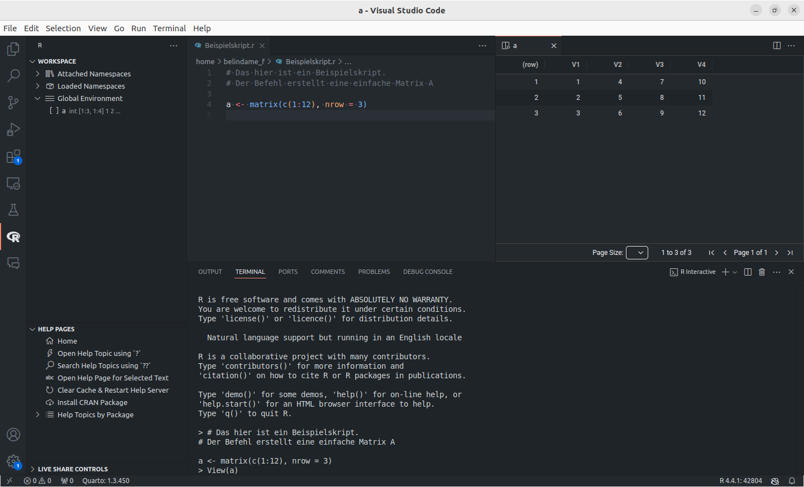

# Titelfolie {.plain}
\center
{width="20%"}

\vspace{2mm}

\Large
Programmierung und Deskriptive Statistik
\vspace{4mm}

\normalsize
BSc Psychologie WiSe 2025/26

\vspace{15mm}
\normalsize
Belinda Fleischmann und Dirk Ostwald


# Termine {.plain}
\setstretch{1.3}
\vfill
\center
\small
\renewcommand{\arraystretch}{1.1}

\begin{tabular}{lllll}
  & Gruppe 1/2  & Gruppe 3    & Format  & Thema                                                \\ \hline
1  & Mi, 15.10. & Do, 16.10.  & Seminar & (1) Grundbegriffe der Informatik                        \\
2  & Mi, 22.10. & Do, 23.10.  & Seminar & (2) Arithmetik und Variablen                         \\
3  & Mi, 29.10. & Do, 30.10.  & Übung   & (2) Arithmetik und Variablen                        \\
\textbf{4}  & \textbf{Mi, 05.11.} & \textbf{Do, 06.11.}  & \textbf{Seminar} & \textbf{(3) Vektoren und Matrizen}                            \\
5  & Mi, 12.11. & Do, 13.11.  & Übung   & (3) Vektoren und Matrizen                            \\ \hline
6  & Mi, 19.11. & Do, 20.11.  & Seminar & (4) Listen und Dataframes                            \\
7  & Mi, 26.11. & Do, 27.11.  & Übung   & (4) Listen und Dataframes                            \\
8  & Mi, 03.12. & Do, 04.12.  & Seminar & (5) Datenmanagement                                  \\
9  & Mi, 10.12. & Do, 11.12.  & Übung   & (5) Datenmanagement                                  \\
   & Mo, 15.12  &             & Abgabe  & \textit{Individualleistung (1/2)}                    \\
10 & Mi, 17.12. & Do, 18.12.  & Seminar & (6) Strukturiertes Progr.: Kontrollfluss, Debugging  \\
11 & Mi, 07.01. & Do, 08.01.  & Seminar & (7) Häufigkeitsverteilungen                          \\
12 & Mi, 14.01. & Do, 15.01.  & Übung   & (7) Häufigkeitsverteilungen                          \\
13 & Mi, 21.01. & Do, 22.01.  & Seminar & (8) Maße der zentralen Tendenz und Datenvariabilität \\
14 & Mi, 28.01. & Do, 29.01.  & Übung   & (8) Maße der zentralen Tendenz und Datenvariabilität \\ 
   & Mo, 02.02  &             & Abgabe  &\textit{Individualleistung (2/2)}                     \\ \hline
\end{tabular}

\vfill


# (3) Vektoren und Matrizen - Titelfolie {.plain}

\vfill
\huge
\begin{center}
(3) Vektoren und Matrizen
\end{center}
\vfill


# AGENDA {.plain}
\large
\setstretch{1.3}
\vfill

Vektoren

\normalsize
$\quad$ Übersicht und Erzeugung

$\quad$ Charakterisierung

$\quad$ Indizierung
 
$\quad$ Arithmetik
 
$\quad$ Attribute

\large

\vspace{4mm}

Matrizen

\normalsize
$\quad$ Übersicht und Erzeugung

$\quad$ Charakterisierung

$\quad$ Indizierung
 
$\quad$ Arithmetik
 
$\quad$ Attribute


\AtBeginSection{}
\section{Vektoren}
# Vektoren ======================================================== {.plain}
\large
\setstretch{1.3}
\vfill

**Vektoren**

\normalsize
$\quad$ Übersicht und Erzeugung

$\quad$ Charakterisierung

$\quad$ Indizierung
 
$\quad$ Arithmetik
 
$\quad$ Attribute

\large

\vspace{4mm}

Matrizen

\normalsize
$\quad$ Übersicht und Erzeugung

$\quad$ Charakterisierung

$\quad$ Indizierung
 
$\quad$ Arithmetik
 
$\quad$ Attribute


\AtBeginSubsection{}
\subsection{Übersicht und Erzeugung}
# Übersicht und Erzeugung ====================================== {.plain}
\large
\setstretch{1.3}
\vfill

**Vektoren**

\normalsize
$\quad$ **Übersicht und Erzeugung**

$\quad$ Charakterisierung

$\quad$ Indizierung
 
$\quad$ Arithmetik
 
$\quad$ Attribute

\large

\vspace{4mm}

Matrizen

\normalsize
$\quad$ Übersicht und Erzeugung

$\quad$ Charakterisierung

$\quad$ Indizierung
 
$\quad$ Arithmetik
 
$\quad$ Attribute


# Übersicht
\setstretch{1.5}


\small

\begin{itemize}
\item R operiert mit \textit{Datenstrukturen} (z.B. Vektoren, Matrizen, Listen und Dataframes).
\item Die einfachste dieser Datenstrukturen ist ein Vektor.
\item Vektoren sind geordnete Folgen von Datenwerten, die in \underline{einem} Objekt zusammengefasst sind und \underline{einem} Variablennamen zugewiesen sind.
\item Die einzelnen Datenwerte eines Vektors heißen \textit{Elemente} des Vektors.
\item Vektoren, deren Elemente alle vom gleichen Datentyp sind, heißen \textbf{atomar}.
\item Die zentralen Datentypen sind \textbf{numeric} (\textbf{double}, \textbf{integer}),  \textbf{logical},  \textbf{character}
\end{itemize}

\vspace{1mm}
{width="90%" fig-align="right"}

* Mit dem Begriff **Vektor** ist hier immer ein **atomarer Vektor** gemeint.

\vfill


# Erzeugung einelementiger Vektoren (Elementarwerte)

\setstretch{1.3}
\small
\vfill
**Numeric** (double, integer)

\footnotesize
Per default werden numerische Werte (mit oder ohne Dezimalstellen) als double initialisiert. Dezimalzahlen können in Dezimalnotation oder wissenschaftlicher Notation spezifiziert werden. Weitere mögliche Werte sind Inf, -Inf, und NaN (Not-a-Number).
\vspace{1mm}
\tiny
```{r, eval = F}
#| label: Elementarwerte Beispiele
h <- 1                    # Einelementiger Vektor vom Typ double (1)
i <- 2.1e2                # Einelementiger Vektor vom Typ double (210)
j <- 2.1e-2               # Einelementiger Vektor vom Typ double (0.021)
k <- Inf                  # Einelementiger Vektor vom Typ double (unendlich)
l <- NaN                  # Einelementiger Vektor vom Typ double (NaN)
```  

\footnotesize
Integer werden wie double ohne Dezimalstellen spezifiziert, gefolgt von einem L (long integer).
\vspace{1mm}
\tiny
```{r, eval = F}
#| label: Integer Beispiele
x <- 1L                   # Einelementiger Vektor vom Typ integer
y <- 200L                 # Einelementiger Vektor vom Typ integer
```

\small
**Logical**

\footnotesize
TRUE oder FALSE, abgekürzt T oder F.
\vspace{1mm}
\tiny
```{r, eval = F}
#| label: Boolesche Werte Beispiele
x <- TRUE                 # Einelementiger Vektor vom Typ logical
y <- F                    # Einelementiger Vektor vom Typ logical
```

\small
**Character**

\footnotesize
Anführungszeichen ("a") oder Hochkommata ('a').
\vspace{1mm}
\tiny
```{r, eval = F}
#| label: character Beispiele
x <- "a"                  # Einelementiger Vektor vom Typ character
y <- 'test'               # Einelementiger Vektor vom Typ character
```


# Erzeugung mehrelementiger Vektoren
\setstretch{1.5}
\small
Direkte Konkatenation von Elementarwerten mit `c()`

\tiny
```{r, eval = F}
#| label: Mehrelementige Vektoren Beispiele
x <- c(1, 2, 3)                    # numeric vector [1,2,3]
y <- c(0, x, 4)                    # numeric vector [0,1,2,3,4]
s <- c("a", "b", "c")              # character vector ["a", "b", "c"]
l <- c(TRUE, FALSE)                # logical vector [TRUE, FALSE]
```

* \footnotesize Beachte: `c()` konkateniert die Eingabeargumente und erzwingt einen einheitlichen Datentyp (vgl. coercion)
\tiny
  ```{r, eval = F}
  #| label: Beispiel coercion
  x <- c(1, "a", TRUE)         # character vector ["1", "a", "TRUE"]
  ```

\small
Erzeugen "leerer" Vektoren mit `vector()`

\tiny
```{r, eval = F}
#| label: Beispiel leere Vektoren mit vector()
v <- vector("double", 3)           # double vector [0,0,0]
w <- vector("integer", 3)          # integer vector [0,0,0]
l <- vector("logical", 2)          # logical vector [FALSE, FALSE]
s <- vector("character", 4)        # character vector ["", "", "", ""]
```

\small
Erzeugen "leerer" Vektoren mit double(), integer(), logical(), character()

\tiny
```{r, eval = F}
#| label: Beispiel leere Vektoren typspezifisch
v <- double(3)                     # double vector [0,0,0]
w <- integer(3)                    # integer vector [0,0,0]
l <- logical(2)                    # logical vector [FALSE, FALSE]
s <- character(4)                  # character vector ["", "", "", ""]
```


# Erzeugung von Vektoren als Sequenzen
\setstretch{1.5}

\small
Erzeugen von ganzzahligen Sequenzen mithilfe des **Colonoperators** `:`

`a:b` erzeugt ganzzahlige Sequenzen von a (inklusive) bis b (maximal)

\tiny
```{r, eval = F}
#| label: Vektor erzeugen mit colon
x <- 0:5                         # [0, 1, 2, 3, 4, 5]
y <- 1.5:6.1                     # [1.5, 2.5, 3.5, 4.5, 5.5]
```

\small
Erzeugen von Sequenzen mit `seq()`

`seq(from, to, by = ((to - from)/(len - 1), len = NULL, ...)`

\tiny
```{r, eval = F}
#| label: Vektor erzeugen mit seq()
x_1 <- seq(0, 5)                 # wie `0:5`, ganzzahlige Sequenz zw. 0 (inkl.) und 5 (max)
                                 # [0, 1, 2, 3, 4, 5]
x_2 <- seq(0, 1, len = 5)        # 5 Zahlen zwischen 0 (inkl.) und 1 (inkl.), equidistant
                                 # [0.00, 0.25, 0.50, 0.75, 1.00]
x_3 <- seq(0, 2, by = .15)       # 0.15 Schritte zwischen 0 (inkl.) und 2 (max.)
                                 # [0.00, 0.15, 0.30, ..., 1.50 1.65 1.80 1.95]
x_4 <- seq(1, 0, by = -.1)       # -0.1 Schritte zwischen 1 (inkl.) und 0 (min.)
                                 # [1.0 0.9 0.8 0.7 0.6 0.5 0.4 0.3 0.2 0.1 0.0]
```

\small
`seq.int()`, `seq_len()`, `seq_along()`  als weitere Varianten

\tiny
```{r, eval = F}
#| label: weitere Funktionen zur Vektorerzeugung
x_1 <- seq.int(0, 5)             # wie `0:5`, ganzzahlige Sequenz zw. 0 (inkl.) und 5 (max)
                                 # [0, 1, 2, 3, 4, 5]
x_2 <- seq_len(5)                # Natürliche Zahlen bis 5, [1, 2, 3, 4, 5]
x_3 <- seq_along(c("a", "b"))    # wie `seq_len(length(c("a", "b")))`
```


\AtBeginSubsection{}
\subsection{Charakterisierung}
# Charakterisierung ====================================== {.plain}
\large
\setstretch{1.3}
\vfill

**Vektoren**

\normalsize
$\quad$ Übersicht und Erzeugung

$\quad$ **Charakterisierung**

$\quad$ Indizierung
 
$\quad$ Arithmetik
 
$\quad$ Attribute

\large

\vspace{4mm}

Matrizen

\normalsize
$\quad$ Übersicht und Erzeugung

$\quad$ Charakterisierung

$\quad$ Indizierung
 
$\quad$ Arithmetik
 
$\quad$ Attribute


# Vektoreigenschaften ausgeben
\setstretch{0.9}
\small

`length()` gibt die Anzahl der Elemente eines Vektors aus
\tiny
```{r, eval = T}
#| label: Beispiel length()
x <- 0:10          # Vektor
length(x)          # Anzahl der Elemente des Vektors
```
\vspace{2mm}
\small
`typeof()` gibt den elementaren Datentyp eines Vektors aus

\tiny
```{r, eval = T}
#| label: Beispiel typeof() 1/2
x <- 1:3L          # Vektor
typeof(x)          # Datentyp des atomic vectors
```
\vspace{2mm}
```{r, eval = T}
#| label: Beispiel typeof() 2/2
y <- c(T, F, T)    # Vektor
typeof(y)          # Datentyp des atomic vectors
```
\vspace{2mm}

\indent Anmerkung:
`mode()` und `storage.mode()` werden nicht empfohlen, sie existieren für S Kompatibilität.

\vspace{3mm}
\small
`is.logical()`, `is.double()`, `is.integer()`, `is.character()` testen den Datentyp

\tiny
```{r, eval = T}
#| label: Beispiel typetest mit is.double()
is.double(x)       # Testen, ob x vom Typ double ist
```
\vspace{2mm}
```{r, eval = T}
#| label: Beispiel typetest mit is.logical()
is.logical(y)      # Testen, ob y vom Typ logical ist
```


# Datentypangleichung (Coercion)

\vspace{2mm}
\setstretch{0.9}

\small
Bei Konkatenation verschiedener Datentypen wird ein einheitlicher Datentyp erzwungen. Es gilt 

\center
character $>$ double $>$ integer $>$ logical
\vspace{2mm}

\justifying
\footnotesize
\vspace{3mm}

```{r, eval = T}
#| label: coersion bei gemischter Vektor 1/2
x <- c(1.2, "a")     # Kombination gemischter Datentypen (character schlägt double)
x
typeof(x)            # Erzeugter Vektor ist vom Datentyp character
```
\vspace{2mm}

```{r, eval = T}
#| label: coersion bei gemischter Vektor 2/2
y <- c(1L, TRUE)     # Kombination  gemischter Datentypen (integer schlägt logical)
y
typeof(y)            # Erzeugter Vektor ist vom Typ integer
```

\vfill


# Datentypangleichung (Coercion)
\vspace{2mm}
\setstretch{1.2}

\justifying
\small
**Explizite** Coercion mit `as.logical()`, `as.integer()`, `as.double()`, `as.character()`
\vspace{1mm}

\footnotesize
```{r, eval = T}
#| label: Explizite Coercion
x <- c(0, 1, 1, 0)        # double Vektor
y <- as.logical(x)        # Umwandlung in logical Vektor
y
```

\vspace{3mm}
\small
Coercion geschieht aber auch oft **implizit**:
\vspace{1mm}

\footnotesize
```{r, eval = T}
#| label: Implizite Coercion
x <- c(T, F, T, T)        # logical Vektor
s <- sum(x)               # Summation wandelt logical Elemente automatisch in integer
s
```

\vfill

\AtBeginSubsection{}
\subsection{Indizierung}
# Indizierung ====================================== {.plain}
\large
\setstretch{1.3}
\vfill

**Vektoren**

\normalsize
$\quad$ Übersicht und Erzeugung

$\quad$ Charakterisierung

$\quad$ **Indizierung**
 
$\quad$ Arithmetik
 
$\quad$ Attribute

\large

\vspace{4mm}

Matrizen

\normalsize
$\quad$ Übersicht und Erzeugung

$\quad$ Charakterisierung

$\quad$ Indizierung
 
$\quad$ Arithmetik
 
$\quad$ Attribute


# Indizierung
\setstretch{1.5}

\normalsize
\textcolor{darkblue}{Grundlagen}
\vspace{-2mm}

\small

* Einzelne oder mehrere Vektorkomponenten werden durch Indizierung adressiert.
* Indizierung wird auch Indexing, Subsetting, oder Slicing genannt.
* Zur Indizierung werden eckige Klammern [$\,\,$] benutzt.
* Indizierung kann zur Kopie oder Manipulation von Komponenten benutzt werden.
* Der Index des ersten Elements ist 1 (nicht 0, wie in anderen Sprachen).

\vspace{1mm}
\normalsize
\textcolor{darkcyan}{Beispiel}
\tiny
```{r, eval = F}
#| label: Indizierung Beispiel
x <- c("a", "b", "c")   # character vector ["a", "b", "c"]
y <- x[2]               # Kopie von "b" (neues Object), referenziert von y
x[3] <- "d"             # Änderung von x zu x = ["a", "b", "d"]
```

\vspace{1mm}
\normalsize
\textcolor{darkblue}{Prinzipien der Indizierung in R}

\small

* Ein **Vektor positiver Zahlen** adressiert entsprechende Komponenten.
* Ein **Vektor negativer Zahlen** adressiert komplementäre Komponenten.
* Ein **logischen Vektor** adressiert die Komponenten mit TRUE.
* Ein **character Vektor** adressiert benannte Komponenten.


# \textcolor{darkcyan}{Beispiele}
\small
Indizierung mit einem **Vektor positiver Zahlen**
\footnotesize
```{r, eval = F}
#| label: Bsp positiv Zahlen
x <- c(1, 4, 9, 16, 25)   # [1, 4, 9, 16, 25]
y <- x[1:3]               # `1:3` erzeugt Vektor [1, 2, 3]; x[1:3] = x[c(1, 2, 3)] = [1, 4, 9]
z <- x[c(1, 3, 5)]        # `c(1, 3, 5)` erzeugt Vektor [1, 3, 5]; x[c(1, 3, 5)] = [1, 9, 25]
```

\small
Indizierung mit einem **Vektor negativer Zahlen**
\footnotesize
```{r, eval = F}
#| label: Bsp negative Zahlen
x <- c(1, 4, 9, 16, 25)   # [1, 4, 9, 16, 25]
y <- x[c(-2, -4)]         # Alle Komponenten außer 2 und 4, x[c(-2, -4)] = [1, 9, 25]
z <- x[c(-1, 2)]          # Gemischte Indizierung nicht erlaubt (Fehlermeldung)
```

\small
Indizierung mit einem **logischen Vektor**
\footnotesize
```{r, eval = F}
#| label: Bsp logischen Vektor
x <- c(1, 4, 9, 16, 25)   # [1, 4, 9, 16, 25]
y <- x[c(T, T, F, F, T)]  # Nur die TRUE Komponenten,  x[c(T, T, F, F, T)] = [1, 4, 25]
z <- x[x > 5]             # x > 5 = [F, F, T, T, T], x[x > 5] = [9, 16, 25]
```

\small
Indizierung mit einem **character Vektor**
\footnotesize
```{r, eval = F}
#| label: Bsp character Vektor
x <- c(1, 4, 9, 16, 25)   # [1, 4, 9, 16, 25]
names(x) <- c("a","b")    # Benennung der Komponenten als [a  b <NA> <NA> <NA>]
y <- x["a"]               # x["a"] = 1
```


# Anmerkungen zur Indizierung in R
\normalsize
R hat eine (zu) hohe Flexibilität bei Indizierung


\footnotesize
\vspace{1mm}

Out-of-range Indizes verursachen keine Fehler, sondern geben \texttt{NA} aus
```{r, eval = F}
#| label: Out-of-range Indizes
x <- c(1, 4, 9, 16, 25)  # [1, 4, 9, 16, 25] = [1^2, 2^2, 3^2, 4^2, 5^2]
y <- x[10]               # x[10] = NA (Not Applicable)
```

\vspace{1mm}

Nichtganzzahlige Indizes verursachen keine Fehler, sondern werden abgerundet
\footnotesize
```{r, eval = F}
#| label: Nicht-ganzahlige indizes
y <- x[4.9]              # x[4.9] = x[4] = 16
z <- x[-4.9]             # x[-4.9] = x[-4] = [1, 4, 9, 25]
```

\vspace{1mm}

Leere Indizes indizieren den gesamten Vektor
\footnotesize
```{r, eval = F}
#| label: leere Indizies
y <- x[]                 # y = x
```

\vfill


\AtBeginSubsection{}
\subsection{Arithmetik}
# Arithmetik ====================================== {.plain}
\large
\setstretch{1.3}
\vfill

**Vektoren**

\normalsize
$\quad$ Übersicht und Erzeugung

$\quad$ Charakterisierung

$\quad$ Indizierung
 
$\quad$ **Arithmetik**
 
$\quad$ Attribute

\large

\vspace{4mm}

Matrizen

\normalsize
$\quad$ Übersicht und Erzeugung

$\quad$ Charakterisierung

$\quad$ Indizierung
 
$\quad$ Arithmetik
 
$\quad$ Attribute


# Elementweise Auswertung

\small
**\textcolor{darkblue}{Unitäre}** arithmetische Operatoren und Funktionen werden elementweise ausgewertet

\footnotesize
```{r, eval = F}
a <- seq(0, 1, len = 11) # a = [ 0.0, 0.1 , ..., 0.9, 1.0]
b <- -a                  # b = [-0.0, -0.1, ..., -0.9, -1.0]
v <- a^2                 # v = [ 0.0^2 ,  0.1^2 , ..., 0.9^2, 1.0^2]
w <- log(a)              # w = [ln(0.0), ln(0.1), ..., ln(0.9), ln(1.0)]
```

\small
**\textcolor{darkblue}{Binäre}** arithmetische Operatoren werden elementweise ausgewertet

\footnotesize
Vektoren gleicher Länge

```{r, eval = F}
#| label: Elementweise Auswertung gleichlange Vektoren
a <- c(1, 2, 3)          # a = [1,2,3]
b <- c(2, 1, 4)          # b = [2,1,4]
v <- a + b               # v = [1,2,3] + [2,1,4] = [1+2,2+1,3+4] = [3,3,7]
w <- a - b               # w = [1,2,3] - [2,1,4] = [1-2,2-1,3-4] = [-1, 1, -1]
x <- a * b               # x = [1,2,3] * [2,1,4] = [1*2,2*1,3*4] = [2, 2, 12]
y <- a / b               # y = [1,2,3] / [2,1,4] = [1/2,2/1,3/4] = [0.50, 2, 0.75]
```

\footnotesize
Vektoren und Skalare

```{r, eval = F}
#| label: Elementw Auswertung unterschiedlich Lange Vektoren
a <- c(1, 2, 3)        # a = [1,2,3]
b <- 2                 # b = [2]
v <- a + b             # v = [1,2,3] + [2,2,2] = [1+2,2+2,3+2] = [3, 4, 5]
w <- a - b             # w = [1,2,3] - [2,2,2] = [1-2,2-2,3-2] = [-1, 2, 1]
x <- a * b             # x = [1,2,3] * [2,2,2] = [1*2,2*2,3*2] = [2, 4, 6]
y <- a / b             # y = [1,2,3] / [2,2,2] = [1/2,2/2,3/2] = [0.5, 1, 1.5]
```


# Recycling
\small
\setstretch{1.4}

* R erlaubt (leider) auch Arithmetik mit Vektoren unterschiedlicher Länge

* Bei ganzzahligen Vielfachen der Länge wird der kürzere Vektor wiederholt. \footnotesize
  ```{r, eval = F}
  #| label: vielfaches
  x <- 1:2                # x = [1, 2], length(x) = 2
  y <- 3:6                # y = [3, 4, 5, 6], length(y) = 4
  v <- x + y              # v = [1, 2, 1, 2] + [3, 4, 5, 6] = [4, 6, 6, 8]
  ```

* \small Arithmetik von Vektoren und Skalaren ist ein Spezialfall dieses Prinzips. \footnotesize
  ```{r, eval = F}
  #| label: Arithmethik mit Vielfaches
  x <- 1:3                # x = [1, 2, 3], length(x) = 3
  y <- 2                  # y = 2, length(y) = 1. y ist ein Skalar.
  v <- x + y              # v = [1, 2, 3] + [2, 2, 2] = [3, 4, 5]
  ```

* \small Bei nicht ganzzahligen Vielfachen der Länge werden die ersten Komponenten des kürzeren Vektors wiederholt. \footnotesize
  ```{r, eval = F}
  #| label: nicht ganzzahliges Vielfaches
  x <- c(1, 3, 5)         # x = [1, 3, 5], length(x) = 3
  y <- c(2, 4, 6, 8, 10)  # y = [2, 4, 6, 8, 10], length(y) = 5
  v <- x + y              # v = [1, 3, 5, 1, 3] + [2, 4, 6, 8, 10] = [3, 7, 11, 9, 13]
  ```

\vfill
\center
\color{darkcyan}
**Generell sollten nur Vektoren gleicher Länge arithmetisch verknüpft werden!**

\vfill


# Fehlende Werte (\texttt{NA})
\small
\setstretch{1.4}

* \texttt{NA} steht für “**N**ot **A**vailable” und repräsentiert fehlende Werte in R

* Das Rechnen mit \texttt{NA}s ergibt (meist) wieder \texttt{NA}. \setstretch{0.9} \footnotesize
  ```{r, eval = T}
  #| label: multiply NA
  3 * NA                  # Multiplikation eines NA Wertes ergibt NA
  ```
  \vspace{2mm}
  ```{r, eval = T}
  #| label: compare NA
  NA < 2                  # Relationaler Vergleich eines NA Wertes ergibt NA
  ```
  \vspace{2mm}
  ```{r, eval = T}
  #| label: NA to the power
  NA^0                    # NA hoch 0 ergibt 1, weil jeder Wert hoch 0 eins ergibt (?)
  ```
  \vspace{2mm}
  ```{r, eval = T}
  #| label: bool with NA
  NA & FALSE              # NA UND FALSE ergibt FALSE
  ```
  \vspace{2mm}


# Fehlende Werte (\texttt{NA})
\small
\setstretch{1.4}

* Auf \texttt{NA} testet man mit `is.na()` oder \texttt{anyNA()}\footnotesize 
  ```{r, eval = T}
  x <- c(NA, 5, NA, 10)  # Vektor mit NAs
  print(x)
  ```
  \vspace{2mm}

  ```{r, eval = T}
  x == NA                # Relationaler Vergleich mit NA ergibt NA
  ```
  \vspace{2mm}
  ```{r, eval = T}
  is.na(x)               # Logisches Testen auf NA für jedes Element
  ```
  \vspace{2mm}
  ```{r, eval = T}
  anyNA(x)               # Logisches Testen auf mind. 1 NA in gesamtem Objekt
  ```

\vfill

# Ungültige Zahlenwerte (\texttt{NaN})
\small
\setstretch{1.4}

* \texttt{NaN} steht für “**N**ot **a** “**N**umber” repräsentiert ungültige Zahlenwerte, z.B. durch undefinierte arithmetische Operationen \footnotesize 
  ```{r, eval = T}
  0 / 0                # 0 durch 0 teilen ist nicht definiert
  ```
  \vspace{2mm}
  ```{r, eval = T}
  sqrt(-1)             # Wurzel einer negativen reellen Zahl ist nicht definiert
  ```
  \vspace{2mm}


* \small In Mathematik und Informatik ist Dividieren durch Null undefiniert. R verwendet jedoch das Konzept "Unendlichkeit": positive Zahlen gehen bei Division durch Null gegen positive Unendlichkeit \texttt{Inf}, negative gegen negative \texttt{-Inf}, ähnlich wie Grenzwerte in der Analysis. \footnotesize \setstretch{1.2}
  ```{r, eval = T}
  4 / 0                # Positive reelle Zahlen durch 0 teilen ist nicht definiert
  ```
  \vspace{2mm}
  ```{r, eval = T}
  -3 / 0               # Negative reelle Zahlen durch 0 teilen ist nicht definiert
  ```
  \vspace{2mm}


# Ungültige Zahlenwerte (\texttt{NaN})
\small
\setstretch{1.4}


* Das Rechnen mit \texttt{NaN} ergibt (meist) wieder \texttt{NaN}. \setstretch{0.9} \footnotesize
  ```{r, eval = T}
  3 * NaN                  # Multiplikation eines NaN Wertes ergibt NaN
  ```
  \vspace{2mm}
  ```{r, eval = T}
  NaN^0                    # NaN hoch 0 ergibt 1, weil jeder Wert hoch 0 eins ergibt (?)
  ```
  \vspace{2mm}

  ```{r, eval = T}
  NaN < 2                  # Relationaler Vergleich eines NaN Wertes ergibt NA
  ```
  \vspace{2mm}
  ```{r, eval = T}
  NaN & FALSE              # NaN UND FALSE ergibt FALSE
  ```
  \vspace{2mm}
  ```{r, eval = T}
  NaN & TRUE               # NaN UND TRUE ergibt NA
  ```
  \vspace{2mm}

# Ungültige Zahlenwerte (\texttt{NaN})
\small
\setstretch{1.4}

* Auf \texttt{NaN} testet man mit `is.nan()` \footnotesize 
  ```{r, eval = T}
  y <- c(NaN, 4, NaN, 3)   # Vektor mit NaNs
  print(y)
  ```
  \vspace{2mm}

  ```{r, eval = T}
  y == NaN                 # Relationaler Vergleich mit NaN ergibt NAs
  ```
  \vspace{2mm}
  ```{r, eval = T}
  is.nan(y)                # Logisches Testen auf NaN für jedes Element
  ```
  \vspace{2mm}
  ```{r, eval = T}
  any(is.nan((y)))         # Logisches Testen auf mind. 1 NaN in gesamtem Objekt
  ```
  \vspace{2mm}


# Leere Werte (\texttt{NULL})
\small
\setstretch{1.4}

* \texttt{NULL} zeigt die völlige Abwesenheit eines Werts an, oft genutzt für leere Objekte. \footnotesize
  ```{r, eval = T}
  w <- c()                 # Leerer Vektor
  print(w)
  ```
  \vspace{2mm}

  ```{r, eval = T}
  z <- c(1, 2, NULL)       # NULL als Vektorelement wird ignoriert
  print(z)                 # Vektor hat nur die Elemete (1, 2)
  ```
  \vspace{2mm}

  ```{r, eval = T}
  print(length(z))         # Die Länge des Vektors beträgt 2
  ```
  \vspace{2mm}

# Leere Werte (\texttt{NULL})
\small
\setstretch{1.4}

* Das Rechnen mit \texttt{NULL} ergibt leere Objekte \setstretch{0.9} \footnotesize
  ```{r, eval = T}
  3 * NULL                  # Multiplikation mit NULL ergibt einen leeren numerischen Vektor
  ```
  \vspace{2mm}

  ```{r, eval = T}
  NULL < 2                  # Relationaler Vergleich mit NULL ergibt leeren logischen Vektor
  ```
  \vspace{2mm}


* Auf \texttt{NULL} testet man mit `is.null()` \footnotesize 
  ```{r, eval = T}
  is.null(NULL)             # Logisches Testen auf NULL
  ```
  \vspace{2mm}

  ```{r, eval = T}
  is.null(logical(0))       # Leere Vektoren sind nicht äquivalent zu NULL
  ```
  \vspace{2mm}

\vfill


# Unterschiede zwischen \texttt{NA}, \texttt{NaN} und \texttt{NULL}
\small
\setstretch{1.4}


* \texttt{NA} repräsentiert allgemein **fehlende** Werte.
* \texttt{NaN} repräsentiert spezifisch **ungültige** numerische Werte, etwa als Ergebnis undefinierter arithmetischer Operationen.
* \texttt{NULL} repräsentiert ein **leeres Objekt**.
* \texttt{NaN} ist ein Sonderfall von \texttt{NA}, während \texttt{NULL} strukturell „nichts“ repräsentiert.
* Alle drei Begriffe \texttt{NA}, \texttt{NaN} und \texttt{NULL} zählen zu den *reserved words* (siehe `?reserved`).
* \texttt{NaN} wird auch von \texttt{is.na()} als fehlender Wert erfasst. Umgekehrt zählt \texttt{is.nan()} jedoch nur numerisch ungültige Werte (\texttt{NaN}) und schließt allgemeine fehlende Werte (\texttt{NA}) aus.


  \footnotesize
  ```{r, eval = T}
  y <- c(NaN, 4, NaN, 3)    # Vektor mit NaNs
  is.na(y)                  # Logisches Testen auf NA für jedes Element
  ```
  \vspace{1mm}
  ```{r, eval = T}
  x <- c(NA, 5, NA, 10)     # Vektor mit NAs
  is.nan(x)                 # Logisches Testen auf NaN für jedes Element
  ```


\AtBeginSubsection{}
\subsection{Attribute}
# Attribute ====================================== {.plain}
\large
\setstretch{1.3}
\vfill

**Vektoren**

\normalsize
$\quad$ Übersicht und Erzeugung

$\quad$ Charakterisierung

$\quad$ Indizierung
 
$\quad$ Arithmetik
 
$\quad$ **Attribute**

\large

\vspace{4mm}

Matrizen

\normalsize
$\quad$ Übersicht und Erzeugung

$\quad$ Charakterisierung

$\quad$ Indizierung
 
$\quad$ Arithmetik
 
$\quad$ Attribute


# Attribute

Attribute sind Metadaten von R Objekten in Form von Schlüssel-Wert-Paaren

\vfill

\small
\textcolor{darkblue}{Attribute ausgeben lassen} mit `attributes()`


\tiny
```{r, eval = T}
#| label: attributes()
a <- 1:3                # Ein numerischer Vektor
attributes(a)           # Aufrufen aller Attribute
```
\small $\to$ Atomic vectors haben per se keine Attribute

\textcolor{darkblue}{Attribute aufrufen und definieren} mit `attr()`

\tiny
```{r, eval = T}
#| label: attr()
attr(a, "S") <- "W"     # a bekommt Attribut mit Schluessel S und Wert W
attr(a, "S")            # Das Attribut mit Schluessel S hat jetzt den Wert W
attributes(a)
```

\vfill
\footnotesize
Anmerkung

\tiny
Attribute werden bei Operationen oft entfernt (Ausnahmen sind `names` und `dim`)
```{r, eval = T}
#| label: attributes removed
b <- a[1]               # Kopie des ersten Elements von a in Vektor b
attributes(b)           # Aufrufen aller Attribute von b
```


# Vektor-Elemente bezeichnen
\setstretch{0.9}

\small

Spezifikation des Attributs `names` gibt den Elementen eines Vektors Namen
\vspace{0.5mm}
\tiny
```{r, eval = T}
#| label: vektor names
v <- c(x = 1, y = 2, z = 3)  # Elementnamengenerierung bei Vektorerzeugung
print(v)                     # Vektorausgabe
```
\vspace{1.5mm}
\small

Die Namen können zur Indizierung benutzt werden
\vspace{0.5mm}
\tiny
```{r, eval = T}
#| label: index vector names
v["y"]                       # Indizierung per Namen
```
\vspace{1.5mm}
\small

Zum Definieren und zum Aufrufen von Namen kann auch `names()` benutzt werden
\vspace{0.5mm}
\tiny
```{r, eval = T}
#| label: names()
y <- 4:6                     # Erzeugung eines Vektors
names(y) <- c("a", "b", "c") # Definition von Namen
names(y)                     # Elementnamenaufruf
```
\vspace{1.5mm}
\small

Benannte Namen können hilfreich sein, wenn der Vektor eine Sinneinheit bildet
\vspace{0.5mm}
\tiny
```{r, eval = T}
#| label: Vektor als Sinneinheit
p <- c(age    = 31,          # Alter (Jahre), Groesse (cm), Gewicht (kg) einer Person
       height = 198,
       weight = 75)
print(p)                     # Vektorausgabe
```


# Exkurs: Styleguide für Zeilenumbrüche in R Code

\small
Es kommt häufig vor, dass der vollständige Befehl nicht in eine Zeile passt. Um Fehler zu vermeiden und die Lesbarkeit zu gewährleisten, gibt es gängige Formatierleitlinien, wenn Code auf mehrere Zeilen verteilt werden muss:

\small
\textcolor{darkblue}{Funktionsaufrufe}. Argumente über mehrere Zeilen verteilen und einrücken

\tiny
```{r, eval = T}
print(
  pi,                   # Das Objekt, das ausgegeben werden soll; Komma da 2. Arg folgt!
  digits=3              # Die Anzahl an digits
)
```

\small
\textcolor{darkblue}{Verschachtelte Funktionen}. Funktionen und Argumente über mehrere Zeilen verteilen und einrücken

\tiny
```{r, eval = T}
round(                  # Äußere Funktion (Ebene 0)
  sum(                  # Innere Funktion (Ebene 1)
    c(7.421, 9.234)     # Vektor als Argument der inneren Funktion (Ebene 2)
  ),                    # Ende der inneren Funktion (Ebene 1)
  digits = 1            # Zweites Argument der äußeren Funktion
)                       # Ende der äußeren Funktion (Ebene 0)
```

* Das Ergebnis der inneren Funktion `sum()` ist das erste Argument der äußeren Funktion `round()`. 
* Zeile 3 (`c(7.421, 9.234)`) ist genau genommen ebenfalls eine Funktion (Vektorbildung), deren Ergebnis das Argument der inneren Funktion `sum()` ist.


\AtBeginSection{}
\section{Matrizen}
# Matrizen ====================================== {.plain}
\large
\setstretch{1.3}
\vfill

Vektoren

\normalsize
$\quad$ Übersicht und Erzeugung

$\quad$ Charakterisierung

$\quad$ Indizierung
 
$\quad$ Arithmetik
 
$\quad$ Attribute

\large

\vspace{4mm}

**Matrizen**

\normalsize
$\quad$ Übersicht und Erzeugung

$\quad$ Charakterisierung

$\quad$ Indizierung
 
$\quad$ Arithmetik
 
$\quad$ Attribute


\AtBeginSubsection{}
\subsection{Übersicht und Erzeugung}
# Übersicht und Erzeugung ====================================== {.plain}
\large
\setstretch{1.3}
\vfill

Vektoren

\normalsize
$\quad$ Übersicht und Erzeugung

$\quad$ Charakterisierung

$\quad$ Indizierung
 
$\quad$ Arithmetik
 
$\quad$ Attribute

\large

\vspace{4mm}

**Matrizen**

\normalsize
$\quad$ **Übersicht und Erzeugung**

$\quad$ Charakterisierung

$\quad$ Indizierung
 
$\quad$ Arithmetik
 
$\quad$ Attribute


# Übersicht
\setstretch{1.7}
\small

Matrizen sind zweidimensionale, rechteckige Datenstrukturen der Form

\footnotesize
\begin{equation}
M = \begin{pmatrix}
m_{11} 		& m_{12} 	& \cdots 	& m_{1n_c} 			\\
m_{21} 		& m_{22} 	& \cdots	& m_{2n_c} 			\\
\vdots		& \vdots 	& \ddots	& \vdots			\\
m_{n_r1} 	& m_{n_r2} 	& \cdots	& {m_{n_rn_c}} 			\\
\end{pmatrix}
\end{equation}

\small
* Die Elemente $m_{ij}, i = 1,...,n_r, j = 1,...,n_c$ sind vom gleichen Typ.
* $n_r$ ist die Anzahl der Zeilen (rows), $n_c$ ist die Anzahl der Spalten (columns).
* Jedes Element einer Matrix hat einen Zeilenindex $i$ und einen Spaltenindex $j$.
* Intuitiv sind Matrizen numerisch indizierte Tabellen.
* Formal sind Matrizen in R zweidimensional interpretierte atomare Vektoren.
* Matrizen in R sind nicht identisch mit dem mathematischen Matrixbegriff.
* Matrizen in R können allerdings für Lineare Algebra verwendet werden.
* Lineare Algebra ist die Sprache (linearer) statistischer Modelle.


# Erzeugung mit `matrix()`
\setstretch{1.4}

Die `matrix()` Funktion befüllt Matrizen mit Vektorelementen
\small

`matrix(data, nrow, ncol, byrow)`

\vspace{2mm}

\footnotesize
```{r, eval = T}
matrix(c(1:12), nrow = 3)               # 3 x 4 Matrix der Zahlen 1,...,12, byrow = FALSE
matrix(c(1:12), ncol = 4)               # 3 x 4 Matrix der Zahlen 1,...,12, byrow = FALSE
matrix(c(1:12), nrow = 3, byrow = TRUE) # 3 x 4 Matrix der Zahlen 1,...,12, byrow = TRUE
```
\vfill


# VSCode Interactive Viewers

\vfill
\textcolor{darkblue}{Table Viewer}
\vfill


{width="75%" fig-align="center"}


\setstretch{1.2}
\footnotesize

Mit dem Befehl `View()` oder im R \fbox{WORKSPACE} $\rightarrow$ \fbox{Global Environment} über das View Symbol {width="4%" fig-align="center"} neben entsprechendem Objekt öffnen.

\tiny
\begin{flushright}
\textcolor{linkblue}{\href{https://github.com/REditorSupport/vscode-R/wiki/Interactive-viewers}{VS Code Wiki - Interactive viewers}}
\end{flushright}


# Erzeugung mit `cbind()`
\setstretch{1.4}

\small
Die Funktion `cbind()` konkateniert passende Matrizen spaltenweise (_column-bind_)

\vspace{3mm}
\footnotesize
```{r, eval = TRUE}
A <- matrix(c(1:4) , nrow = 2)       # 2 x 2 Matrix der Zahlen 1,...,4
print(A)
B <- matrix(c(5:10), nrow = 2)       # 2 x 3 Matrix der Zahlen 5,...,10
print(B)
C <- cbind(A, B)                     # Spaltenweise Konkatenierung von A und B
print(C)
```

\vfill


# Erzeugung mit `rbind()`
\setstretch{1.4}
\vspace{2mm}
\small
Die Funktion `rbind()` konkateniert passende Matrizen reihenweise (_row-bind_)

\vspace{3mm}
\footnotesize
```{r, eval = T}
A <- matrix(c(1:6) , nrow = 2, byrow = T)  # 2 x 3 Matrix der Zahlen 1,...,6
print(A)
B <- matrix(c(7:9), nrow = 1)              # 1 x 3 Matrix der Zahlen 5,...,10
print(B)
C <- rbind(A, B)                           # reihenweise Konkatenierung von A und B
print(C)
```


\AtBeginSubsection{}
\subsection{Charakterisierung}
# Charakterisierung ====================================== {.plain}
\large
\setstretch{1.3}
\vfill

Vektoren

\normalsize
$\quad$ Übersicht und Erzeugung

$\quad$ Charakterisierung

$\quad$ Indizierung
 
$\quad$ Arithmetik
 
$\quad$ Attribute

\large

\vspace{4mm}

**Matrizen**

\normalsize
$\quad$ Übersicht und Erzeugung

$\quad$ **Charakterisierung**

$\quad$ Indizierung
 
$\quad$ Arithmetik
 
$\quad$ Attribute


# Charakterisierung
\setstretch{1.5}
\vspace{2mm}

\small
`typeof()`gibt den elementaren Datentyp einer Matrix aus

\footnotesize
```{r, eval = T}
A <- matrix(c(T, T, F, F), nrow = 2)        # 2 x 2 Matrix von Elementen vom Typ logical
typeof(A)
B <- matrix(c("a", "b", "c"), nrow = 1)     # 1 x 3 Matrix von Elementen vom Typ character
typeof(B)
```

\small
`nrow()` und `ncol()` geben die Zeilen- bzw. Spaltenanzahl aus

\footnotesize
```{r, eval = T}
C <- matrix(1:12, nrow = 3)                 # 3 x 4 Matrix
nrow(C)                                     # Anzahl Zeilen
ncol(C)                                     # Anzahl Spalten
```

\vfill


\AtBeginSubsection{}
\subsection{Indizierung}
# Indizierung ====================================== {.plain}
\large
\setstretch{1.3}
\vfill

Vektoren

\normalsize
$\quad$ Übersicht und Erzeugung

$\quad$ Charakterisierung

$\quad$ Indizierung
 
$\quad$ Arithmetik
 
$\quad$ Attribute

\large

\vspace{4mm}

**Matrizen**

\normalsize
$\quad$ Übersicht und Erzeugung

$\quad$ Charakterisierung

$\quad$ **Indizierung**
 
$\quad$ Arithmetik
 
$\quad$ Attribute


# \textcolor{darkblue}{Indizierung}
\setstretch{1.4}

Generell gilt
\small

* Matrixelemente werden mit einen Zeilenindex und einem Spaltenindex indiziert.
* Die Indexreihenfolge ist immer 1. Zeile, 2. Spalte.
* Die Prinzipien der Indizierung entsprechen der Vektorindizierung.
* Indizes verschiedener Dimensionen können unterschiedlich indiziert werden.
* Eindimensionale Resultate liegen als Vektor, nicht als Matrix vor.

\vspace{1mm}

\textcolor{darkcyan}{Beispiele}
\tiny
\vspace{1mm}
```{r, eval = T}
A <- matrix(c(2:7)^2, nrow = 2)      # 2 x 3 Matrix der Zahlen 2^2,...,7^2
print(A)
a_13 <- A[1, 3]                      # Element in 1. Zeile, 3. Spalte von A [36]
a_22 <- A[2, 2]                      # Element in 2. Zeile, 2. Spalte von A [25]
a_2. <- A[2,]                        # Alle Elemente der 2. Zeile [9,25,49]
a_.3 <- A[,3]                        # Alle Elemente der 3. Spalte [36,49]
A_12 <- A[1:2, 1:2]                  # Submatrix der ersten zwei Zeilen und Spalten
A10  <- A[A>10]                      # Elemente von A groesser 10 [16,25,36,49]
A_13 <- A[1, c(F, F, T)]             # Element in 1. Zeile, 3. Spalte von A [36]
```


\AtBeginSubsection{}
\subsection{Arithmetik}
# Arithmetik ====================================== {.plain}
\large
\setstretch{1.3}
\vfill

Vektoren

\normalsize
$\quad$ Übersicht und Erzeugung

$\quad$ Charakterisierung

$\quad$ Indizierung
 
$\quad$ Arithmetik
 
$\quad$ Attribute

\large

\vspace{4mm}

**Matrizen**

\normalsize
$\quad$ Übersicht und Erzeugung

$\quad$ Charakterisierung

$\quad$ Indizierung
 
$\quad$ **Arithmetik**
 
$\quad$ Attribute


# Unitäre arithmetische Operationen

\small
**\textcolor{darkblue}{Unitäre}** arithmetische Operatoren und Funktionen werden elementweise ausgewertet.

\vfill

\tiny
```{r, eval = T}
A <- matrix(c(1:4), nrow = 2)  # 2 x 2 Matrix der Zahlen 1,2,3,4
print(A)

B <- A^2                       # B[i,j]  = A[i,j]^2,  1 <= i,j <= 2
print(B)

C <- sqrt(B)                   # C[i,j]  = sqrt(A[i,j]^2),  1 <= i,j <= 2
print(C)

D <- exp(A)                    # D[i,j] = exp(A[i,j]),  1 <= i,j <= 2
print(D)
```


# Binäre arithmetische Funktionen
\small
Matrizen **passender Größen** können mit binären arithmetischen Operatoren verknüpft werden.

**\textcolor{darkblue}{Binäre}** arithmetische Operatoren +,-,*,\textbackslash werden bei gleicher Größe elementweise ausgewertet.
\small

\vfill

\tiny
```{r, eval = T}
A <- matrix(c(1:4), nrow = 2)      # 2 x 2 Matrix der Zahlen 1,2,3,4
print(A)

B <- matrix(c(5:8), nrow = 2)      # 2 x 2 Matrix der Zahlen 5,6,7,8
print(B)

print(A + B)                       # C[i,j] = A[i,j] + B[i,j], 1 <= i,j <= 2

print(A * B)                       # C[i,j] = A[i,j] * B[i,j], 1 <= i,j <= 2
```


# Lineare Algebra
\vspace{1mm}
\small

Lineare Algebra mit R Matrizen

* Addition, Subtraktion, Hadamardprodukt elementweise definiert wie oben
* Matrixmultiplikation, Transposition, Inversion, Determinante

\vspace{1mm}
\tiny

```{r, eval = T}
C <- A  %*% B          # 2 x 2 Matrixprodukt
print(C)

A_T <- t(A)            # Transposition von A
print(A_T)

A_inv <- solve(A)      # Inverse von A
print(A_inv)

A_det <- det(A)        # Determinante von A
print(A_det)
```


\AtBeginSubsection{}
\subsection{Attribute}
# Attribute ====================================== {.plain}
\large
\setstretch{1.3}
\vfill

Vektoren

\normalsize
$\quad$ Übersicht und Erzeugung

$\quad$ Charakterisierung

$\quad$ Indizierung
 
$\quad$ Arithmetik
 
$\quad$ Attribute

\large

\vspace{4mm}

**Matrizen**

\normalsize
$\quad$ Übersicht und Erzeugung

$\quad$ Charakterisierung

$\quad$ Indizierung
 
$\quad$ Arithmetik
 
$\quad$ **Attribute**


# Attribute

\small
Formal sind Matrizen atomare Vektoren  mit einem Attribut namens "`dim`".

\tiny
\vspace{1mm}
```{r, eval = T}
A <- matrix(1:12, nrow = 4 )             #  4 x 3 Matrix
attributes(A)                            # Aufrufen der Attribute von A
```
\vspace{2mm}
\small
`rownames()` und `colnames()` spezifizieren das Attribut "`dimnames`".
\tiny
\vspace{1mm}
```{r, eval = T}
rownames(A) <- c("P1", "P2", "P3", "P4") # Benennung der Zeilen von A
colnames(A) <- c("Age", "Hgt", "Wgt")    # Benennung der Spalten von A
print(A)                                 # A mit Attribut dimnames
attr(A, "dimnames")                      # Aufrufen des Attributs dimnames
```

Anmerkung: \textcolor{darkcyan}{Bei Matrizen ist die Benennung von Zeilen und Spalten eher ungewöhnlich.}
