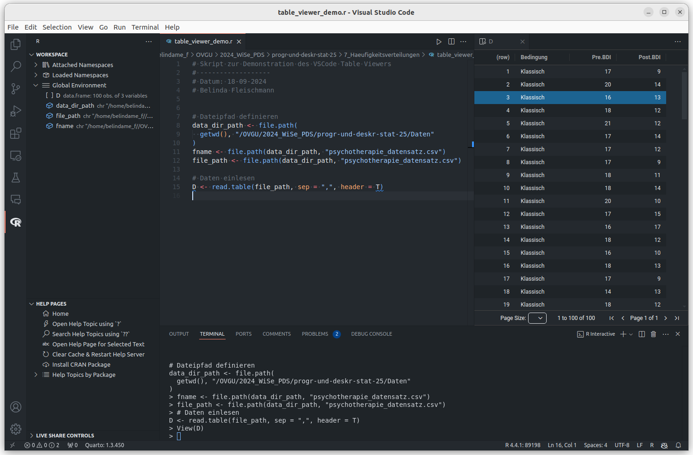
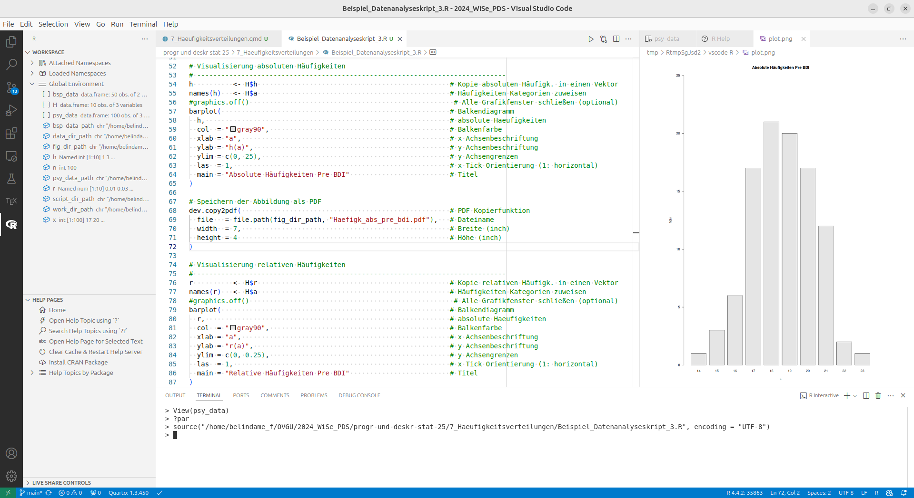

# Titelfolie {.plain}
\center
{width="20%"}

\vspace{2mm}

\Large
Programmierung und Deskriptive Statistik
\vspace{4mm}

\normalsize
BSc Psychologie WiSe 2025/26

\vspace{15mm}
\normalsize
Belinda Fleischmann und Dirk Ostwald


# Termine {.plain}
\setstretch{1.3}
\vfill
\center
\small
\renewcommand{\arraystretch}{1.1}

\begin{tabular}{lllll}
  & Gruppe 1/2  & Gruppe 3    & Format  & Thema                                                \\ \hline
1  & Mi, 15.10. & Do, 16.10.  & Seminar & (1) Grundbegriffe der Informatik                     \\
2  & Mi, 22.10. & Do, 23.10.  & Seminar & (2) Arithmetik und Variablen                         \\
3  & Mi, 29.10. & Do, 30.10.  & Übung   & (2) Arithmetik und Variablen                         \\
4  & Mi, 05.11. & Do, 06.11.  & Seminar & (3) Vektoren und Matrizen                            \\
5  & Mi, 12.11. & Do, 13.11.  & Übung   & (3) Vektoren und Matrizen                            \\
6  & Mi, 19.11. & Do, 20.11.  & Seminar & (4) Listen und Dataframes                            \\
7  & Mi, 26.11. & Do, 27.11.  & Übung   & (4) Listen und Dataframes                            \\
8  & Mi, 03.12. & Do, 04.12.  & Seminar & (5) Datenmanagement       \\
9  & Mi, 10.12. & Do, 11.12.  & Übung   & (5) Datenmanagement                                  \\
   & Mo, 15.12  &             & Abgabe  & \textit{Individualleistung (1/2)}                    \\
10 & Mi, 17.12. & Do, 18.12.  & Seminar & (6) Strukturiertes Progr.: Kontrollfluss, Debugging  \\
\textbf{11} & \textbf{Mi, 07.01.} & \textbf{Do, 08.01.}  & \textbf{Seminar} & \textbf{(7) Häufigkeitsverteilungen}                          \\
12 & Mi, 14.01. & Do, 15.01.  & Übung   & (7) Häufigkeitsverteilungen                          \\
13 & Mi, 21.01. & Do, 22.01.  & Seminar & (8) Maße der zentralen Tendenz und Datenvariabilität \\
14 & Mi, 28.01. & Do, 29.01.  & Übung   & (8) Maße der zentralen Tendenz und Datenvariabilität \\ 
   & Mo, 02.02  &             & Abgabe  &\textit{Individualleistung (2/2)}                     \\ \hline
\end{tabular}

\vfill


```{r, eval = T, echo = F}
# | label: define directories
abbildungsordner <- file.path(dirname(getwd()), "VL_Abbildungen")
datenordner      <- file.path(dirname(getwd()), "Data")
```


# Häufigkeitsverteilungen - Titelfolie {.plain}

\vfill
\huge
\begin{center}
(7) Häufigkeitsverteilungen
\end{center}
\vfill


# AGENDA {.plain}
\large
\setstretch{2.5}
\vfill

Motivation

Beispieldatensatz

Häufigkeitsverteilungen

Histogramme

Empirische Verteilungsfunktionen

Quantile und Boxplots

\vfill


\AtBeginSection{}
\section{Motivation}
# Motivation ====================================== {.plain}

\large
\setstretch{2.5}
\vfill

**Motivation**

Beispieldatensatz

Häufigkeitsverteilungen

Histogramme

Empirische Verteilungsfunktionen

Quantile und Boxplots

\vfill


# Motivation
\setstretch{1.8}
\justifying
\normalsize
\textcolor{darkblue}{Definition und Ziele der Deskriptiven Statistik}

\small
* \justifying Die Deskriptive Statistik ist die *beschreibende* Statistik.
* Ziel ist es, Daten der menschlichen Betrachtung zugänglich zu machen.
* Reine Zahlendarstellungen sind bei großen Datensätzen schwer zu erfassen.
* Deskriptivstatistiken bieten graphische Darstellungen und zusammenfassende Maßzahlen, die charakteristische Aspekte eines Datensatzes wie seinen "durchschnittlicher" Wert oder seine Variabilität beschreiben.

\normalsize
\textcolor{darkblue}{Typische Methoden der Deskriptiven Statistik}

\small
* \justifying Häufigkeitsverteilungen und Histogramme
* Verteilungsfunktionen und Quantile
* Maße der zentralen Tendenz und der Datenvariabilität


# Motivation
\setstretch{1.8}
\justifying
\normalsize
\textcolor{darkblue}{Bezug zu Wahrscheinlichkeitstheorie}

\small
* \justifying Die Deskriptive Statistik basiert nicht auf der Wahrscheinlichkeitstheorie.
* Allerdings ergeben viele Aspekte der Deskriptivstatistik erst vor dem Hintergrund wahrscheinlichkeitstheoretischer Betrachtungen Sinn.
* Umgekehrt sind viele Begriffe der Wahrscheinlichkeitstheorie durch deskriptivstatistische Konzepte motiviert.
* Auch wenn diese Einheit ohne wahrscheinlichkeitstheoretischen Hintergrund auskommt, erschließt sich seine volle Bedeutung erst im Kontext der Begriffe der Wahrscheinlichkeitstheorie.

\vfill


\AtBeginSection{}
\section{Beispieldatensatz}
# Beispieldatensatz ====================================== {.plain}

\large
\setstretch{2.5}
\vfill

Motivation

**Beispieldatensatz**

Häufigkeitsverteilungen

Histogramme

Empirische Verteilungsfunktionen

Quantile und Boxplots

\vfill


# Beispieldatensatz
\textcolor{darkblue}{Evidenzbasierte Evaluation von Psychotherapieformen bei Depression}

\normalsize
{width="110%"}


# Beispieldatensatz
\textcolor{darkblue}{Evidenzbasierte Evaluation von Psychotherapieformen bei Depression}

\normalsize
Becks Depressions-Inventar (BDI-II) zur Depressionsdiagnostik


# Beispieldatensatz
\textcolor{darkblue}{Beispiel: Evaluation von Psychotherapieformen bei Depression}
\vspace{2mm}

{width="90%"}


# Beispieldatensatz
```{r, echo = F, eval = F}
# | label: data simulation
# seed
set.seed(5)


# Simulationsparameter
n      <- 50                         # Anzahl Proband:innnen pro Gruppe
mu     <- c(18, 12, 19, 14)          # \mu (prä-klassisch, post-klassisch, prä-online, post-online)
sigsqr <- 3                          # \sigma^2

# Datensimulation 
D            <- data.frame(
               c(rep("Klassisch",n), rep("Online", n)),
               c(round(rnorm(n, mu[1], sqrt(sigsqr))), round(rnorm(n, mu[3], sqrt(sigsqr)))),
               c(round(rnorm(n, mu[2], sqrt(sigsqr))), round(rnorm(n, mu[4], sqrt(sigsqr)))))
colnames(D)  <- c("Bedingung", "Pre BDI", "Post BDI")

# Datenspeicherung
datenordner  <- file.path(dirname(getwd()), "Daten")
dateiname    <- file.path(datenordner, "psychotherapie_datensatz.csv") 
write.csv(D, file = dateiname, row.names = F)
```


Einlesen des Datensatzes mit `read.table()`
\vspace{1mm}

\footnotesize
```{r echo=FALSE, eval = T}
datenordner <- file.path(dirname(getwd()), "Daten")
```
\footnotesize

```{r, eval = T}
dateipfad <- file.path(datenordner, "psychotherapie_datensatz.csv")
D         <- read.csv(dateipfad)
```


\normalsize
Daten der ersten acht Proband:innen jeder Gruppe
\vspace{3mm}

\tiny
\setstretch{0.9}
```{r, echo = T, eval = T}
head(D[D$Bedingung == "Klassisch", ], 8)
```
\vspace{3mm}
```{r, echo = T, eval = T}
head(D[D$Bedingung == "Online", ], 8)
```

```{r, echo = F, eval = F}
# table visualization
knitr::kable(D[c(1:8, 51:58),],
             align  = "ccc",
             format = "pipe")
```


# VSCode Interactive Viewers

\textcolor{darkblue}{Table Viewer}

\vfill

{width="80%" fig-align="center"}


\setstretch{1.2}
\footnotesize

Mit dem Befehl `View()` oder im R \fbox{WORKSPACE} $\rightarrow$ \fbox{Global Environment} über das View Symbol {width="4%"} neben entsprechendem Objekt


\tiny
\begin{flushright}
\textcolor{linkblue}{\href{https://github.com/REditorSupport/vscode-R/wiki/Interactive-viewers}{VS Code Wiki - Interactive viewers}}
\end{flushright}

# Datenvorverarbeitung

\textcolor{darkblue}{Überlegungen für die Datenvorverarbeitung}

\small
* Studienfokus ist die **Veränderung** der Depressionsymptomatik durch Therapieformen.

* Für jede Proband:in ergibt sich diese Veränderung als **Differenz** zwischen Post.BDI und Pre.BDI.

* Eine Reduktion der Depressionssymptomatik ergibt dabei einen **negativen Wert**.

* Es ist intuitiver, Verbesserungen mit **positiven Zahlen** zu repräsentieren.

* Als Quantifizierung des Therapieeffekts bei Proband:in $i$ bietet sich also folgendes Maß an

\begin{equation}
\Delta \mbox{BDI[i]} := - (\mbox{Post.BDI[i]} - \mbox{Pre.BDI[i]})
\end{equation}

* Wir betrachten in der Folge also das $\Delta \mbox{BDI}$ Maß mit folgenden Interpretationen

\center
\begin{tabular}{lll}
$\Delta \mbox{BDI} > 0$ & Verminderung der Depressionsymptomatik       & Wirksame Therapie      \\
$\Delta \mbox{BDI} = 0$ & Keine Veränderung der Depressionsymptomatik  & Wirkungslose Therapie  \\
$\Delta \mbox{BDI} < 0$ & Verstärkung der Depressionsymptomatik        & Schädigende Therapie   \\
\end{tabular}


# Datenvorverarbeitung
\vspace{1mm}

\small
Hinzufügen einer $\Delta\mbox{BDI}$ Spalte zum Dataframe
\vspace{1mm}

\footnotesize
```{r, eval = T}
#| label: Das Delta BDI Maß
D$Delta.BDI <- -(D$Post.BDI - D$Pre.BDI)                                  # \Delta BDI Maß
```

\small
Daten der ersten acht Proband:innen jeder Gruppe
\vspace{1mm}

\tiny
\setstretch{0.9}
```{r, echo = F, eval = T}
head(D[D$Bedingung == "Klassisch", ], 8)
head(D[D$Bedingung == "Online", ], 8)
```

\tiny
\setstretch{1}
```{r, echo = F, eval = F}
#| label: table visualization
knitr::kable(D[c(1:8, 51:58),],
             align      = "cccc",
             "pipe")
```


\AtBeginSection{}
\section{Häufigkeitsverteilungen}
# Häufigkeitsverteilungen ====================================== {.plain}

\large
\setstretch{2.5}
\vfill

Motivation

Beispieldatensatz

**Häufigkeitsverteilungen**

Histogramme

Empirische Verteilungsfunktionen

Quantile und Boxplots

\vfill


# Absolute und relative Häufigkeitsverteilungen
\small
\begin{definition}[Absolute und relative Häufigkeitsverteilungen]
\justifying
$y := (y_1,...,y_n)$ sei ein Datensatz und $W := \{w_1,...,w_k\}$ mit $k \le n$ 
seien die im Datensatz vorkommenden Werte. Dann heißt die Funktion
\begin{equation}
h : W \to \mathbb{N}, w \mapsto h(w) := \mbox{Anzahl der } y_i \mbox{ aus } y \mbox{ mit } y_i = w
\end{equation}
die \textit{absolute Häufigkeitsverteilung} der Werte von $y$ und die Funktion
\begin{equation}
r : W \to [0,1], w \mapsto r(w) := \frac{h(w)}{n}
\end{equation}
heißt die \textit{relative Häufigkeitsverteilung} der Werte von $y$.
\end{definition}

\footnotesize
Bemerkungen

* Absolute und relative Häufigkeitsverteilungen fassen Datensätze zusammen
* Absolute und relative Häufigkeitsverteilungen können einen ersten Datenüberblick geben


# Berechnung der Häufigkeitsverteilungen
\vspace{2mm}
\small

Die **absoluten Häufigkeiten** einer kategorialen Variable können in R mit der Funktion \texttt{table()} bestimmt werden.

\setstretch{1.2}
\footnotesize
```{r, eval = T}
y        <- D$Pre.BDI                  # double vector der Pre BDI Werte
n        <- length(y)                  # Anzahl der Datenwerte (hier: 100)
H        <- as.data.frame(table(y))    # absolute Häufigkeitsverteilung als Dataframe
names(H) <- c("w", "h")                # Benennen der Spalten im Dataframe
```


\small

Die **relativen Häufigkeiten** erhält man, indem man die absoluten Häufigkeiten durch die Stichprobengröße $n$ teilt.

\vspace{1mm}

\setstretch{1.2}
\footnotesize
```{r, eval = T}
H$r      <- H$h / n                    # Neue Spalte mit relativen Häufigkeiten
print(H)                               # Ausgabe des Dataframes
```


\small


\footnotesize
\setstretch{1}
```{r, echo = F, eval = F}
# table visualization
knitr::kable(H,
             align      = "ccc",
             "pipe")
```


# Visualisierung Häufigkeitsverteilungen
Visualisierung der absoluten Häufigkeitsverteilung mit `barplot()`

\footnotesize
\vspace{1mm}
\setstretch{1.1}

```{r, eval = F}
h          <- H$h             # Kopie der absoluten Häufigkeiten in einen Vektor
names(h)   <- H$w             # Den Häufigkeitswerten die entsprechenden Kategorien zuweisen
barplot(                      # Balkendiagramm
  h,                          # absolute Haeufigkeiten
  col  = "gray90",            # Balkenfarbe
  xlab = "w",                 # x Achsenbeschriftung
  ylab = "h(w)",              # y Achsenbeschriftung
  ylim = c(0, 25),            # y Achsengrenzen
  las  = 2,                   # x Tick Orientierung (2: perpendicular to the axis)
  main = "Pre BDI"            # Titel
)
```

\footnotesize
\vfill

Anmerkungen

* Allgemeine \textbf{R Graphics} Plot Parameter können mit \texttt{?par} und Plotspezifische Parameter auf der jeweiligen Plot Help Page (z.B. \texttt{?barplot}) nachgeschlagen werden


# Visualisierung Häufigkeitsverteilungen

\footnotesize
\vspace{1mm}
\setstretch{1.1}


\normalsize
\setstretch{1.5}

Speichern von Abbildungen mit `dev.copy2pdf()`

\setstretch{1.1}

\footnotesize
\vspace{1mm}
```{r, eval = F}

# Variante 1: Dateinamen im selben Verzeichnis wie das Skript erstellen
skriptordner      <- sys.frame(1)$ofile  # Verzeichnis des aktuellen Skripts ermitteln
abb_ausgabepfad   <- file.path(          # Absoluter Pfad zur Zieldatei im Skriptverzeichnis
  skriptordner,
  "pds_7_ah_prebdi.pdf"
)

# Variante 2: Dateinamen in einem Unterverzeichnis "Abbildungen" im Arbeitsverzeichnis erstellen
abbildungsordner  <- file.path(          # Absoluter Pfad zum Unterverzeichnis "Abbildungen"
  getwd(),                               # Im Beispiel hier: im aktuellen working directory
  "VL_Abbildungen"
)       
abb_ausgabepfad   <- file.path(          # Absoluter Pfad zur Zieldatei im Abbildungsverzeichnis
  abbildungsordner,
  "pds_7_ah_prebdi.pdf"
)

# Speichern der Abbildung als PDF
dev.copy2pdf(                            # PDF Kopierfunktion
  file   = abb_ausgabepfad,              # Dateiname
  width  = 7,                            # Breite (inch)
  height = 4                             # Höhe (inch)
)
```

\vfill


# Beispieldatensatz
Absolute Häufigkeitsverteilung aller Pre-BDI Werte
\vspace{4mm}

```{r, echo = F, eval = F}
h           <- H$h                  # h(w) Werte
names(h)    <- H$w                  # barplot braucht w Werte als names
barplot(                            # Balkendiagramm
  h,                                # absolute Haeufigkeiten
  col       = "gray90",             # Balkenfarbe
  xlab      = "w",                  # x Achsenbeschriftung
  ylab      = "h(w)",               # y Achsenbeschriftung
  ylim      = c(0, 25),             # y Achsengrenzen
  las       = 2,                    # Orientierung der x ticks senkrecht (90°)
  main  		= "Pre BDI"             # Titel
)
dev.copy2pdf(                                                     # PDF Kopiefunktion
  file      = file.path(abbildungsordner, "pds_7_ah_prebdi.pdf"), # Dateiname
  width     = 7,                                                  # Breite (inch)
  height    = 4
)
```


{width="90%"}


# Beispieldatensatz
Relative Häufigkeitsverteilung aller Pre-BDI Werte
\vspace{4mm}

```{r, echo = F, eval = F}
r          <- H$r          # h(r) Werte
names(r)   <- H$w          # barplot braucht w Werte als names
barplot(                   # Balkendiagramm
  r,                       # relative Haeufigkeiten
  col  = "gray90",         # Balkenfarbe
  xlab = "w",              # x Achsenbeschriftung
  ylab = "r(w)",           # y Achsenbeschriftung
  ylim = c(0, 0.25),       # y Achsengrenzen
  las  = 2,                # Anzeigen aller x Werte
  main = "Pre BDI"         # Titel
)
dev.copy2pdf(              # PDF Kopiefunktion
  file   = file.path(abbildungsordner, "pds_7_rh_prebdi.pdf"),  # Dateiname
  width  = 7,                                                   # Breite (inch)
  height = 4
)
```

{width="90%"}


# Grafikfenster und Plot Viewer in VS Code

\textcolor{darkblue}{Der base VSCode-R plot viewer (\texttt{png} device)}

\setstretch{1.2}
\footnotesize

Wenn Visualisierungen in R erstellt werden, öffnet sich standardmäßig ein Grafikfenster (graphical device). Dieses Fenster wird verwendet, um die Plots anzuzeigen.

{width="70%" fig-align="center"}

In Theorie können Grafikfenster mit \texttt{dev.new()} neu geöffnet und mit \texttt{dev.off()} geschlossen werden. Allerdings ist dieses Verhalten in VS Code nicht immer konsistent. Mit \texttt{graphics.off()} können jedoch alle noch offenen Grafikfenster geschlossen werden, bevor eine neue erstellt werden soll.


\AtBeginSection{}
\section{Histogramme}
# Histogramme ====================================== {.plain}

\large
\setstretch{2.5}
\vfill

Motivation

Beispieldatensatz

Häufigkeitsverteilungen

**Histogramme**

Empirische Verteilungsfunktionen

Quantile und Boxplots

\vfill


# Definition
\small

\begin{definition}[Histogramm]
\justifying
Ein \textit{Histogramm} ist ein Diagramm, in dem zu einem Datensatz $y = (y_1,...,y_n)$ mit 
Werten $W := \{w_1,...,w_m\}$ mit $m \le n$ für $j = 1,...,k$ über 
benachbarten Intervallen 
$[b_{j-1},b_j[$ mit $b_0 := \min W$ und $b_k := \max W$ 
Rechtecke mit der 
\vspace{1mm}
\begin{center}
\begin{tabular}{ll}
\textit{Breite} $d_j := b_j - b_{j-1}$ und der  \\
\textit{Höhe} $h(w)$ oder $r(w)$ für $w \in [b_{j-1}, b_{j}[$ 
\end{tabular}
\end{center}
\vspace{1mm}
abgebildet sind.
Dabei werden die Intervalle $[b_{j-1},b_j[$ \textit{Klassen} (engl. \textit{bins}) genannt.
\end{definition}

Bemerkungen

* Das Aussehen eines Histogramms ist stark von der Anzahl $k$ der Klassen abhängig.
* Im Folgenden sind einige konventionelle Methoden zur Bestimmung von $k$ aufgeführt ($\lceil \cdot \rceil$ ist die Aufrundungsfunktion).

\footnotesize

\setstretch{1.6}

\begin{center}
\begin{tabular}{ll} 
$k := \lceil \frac{b_k - b_0}{d} \rceil$ & Bestimmung der Anzahl der Klassen aus gewünschter Klassenbreite $d$ \\
$k := \lceil \sqrt{n} \rceil$ & Klassenanzahl in Excel \\
$k := \lceil \log_2 n + 1 \rceil$ & Implizite Normalverteilungsannahme (Sturges, 1926) \\
$d := 3.49 \cdot \frac{S}{\sqrt[3]{n}}$ & Berechnung $d$ nach Scott (1979): Min. MSE Dichteschätzung bei Normalverteilung
\end{tabular}
\end{center}

# Berechnung und Visualisierung von Histogrammen
Berechnung und Visualisierung von Histogrammen mit `hist()`

\small
* Die Klassen $[b_{j-1}, b_{j}[, j = 1,...,k$ werden als Argument `breaks` festgelegt
* `breaks` ist der R Vector c$(b_0,b_1,...,b_k)$ mit Länge $k + 1$
* Per default benutzt `hist()` eine Modifikation der Sturges Empfehlung $k = \lceil \log_2 n + 1\rceil$
* `hist()` bietet eine Vielzahl weiterer Spezifikationsmöglichkeiten

\vspace{2mm}
\footnotesize
```{r, eval = F}
# Default Histogramm
y     <- D$Pre.BDI            # Datensatz
x_min <- 12                   # x Achsengrenze (links)
x_max <- 25                   # x Achsengrenze (rechts)
y_min <- 0                    # y Achsengrenze (unten)
y_max <- 45                   # y Achsengrenze (oben)

hist(                         # Histogramm
  y,                          # Datensatz
  xlim = c(x_min, x_max),     # x Achsengrenzen
  ylim = c(y_min, y_max),     # y Achsengrenzen
  ylab = "Häufigkeit",        # y-Achsenbezeichnung
  xlab = "",                  # x-Achsenbezeichnung
  main = "Pre-BDI, R Default" # Titel
)
```

```{r, echo = F, eval = F}

# Default Histogramm
y       <- D$Pre.BDI                                                             # Datensatz
x_min   <- 12                                                                    # x-Achsenlimit
x_max   <- 25                                                                    # x-Achsenlimit
y_min   <- 0                                                                     # y-Achsenlimit
y_max   <- 45                                                                    # y-Achsenlimit

hist(                                                                            # Histogramm
y,                                                                               # Datensatz
xlim    = c(x_min, x_max),                                                      # x Achsen Limits
ylim    = c(y_min, y_max),                                                      # y Achsen Limits
ylab    = "Häufigkeit",                                                         # y-Achsenbezeichnung
xlab    = "",                                                                   # x-Achsenbezeichnung
main    = "Pre-BDI, R Default")                                                 # Titel
dev.copy2pdf(file = file.path(abbildungsordner, "pds_7_hg_0.pdf"), width = 8, height = 5) # PDF Speicherung                                                                          

# Histogramm mit gewünschter Klassenbreite d = 1
d       <- 1                                                                      # gewünschte Klassenbreite
b_0     <- min(y)                                                                 # b_0
b_k     <- max(y)                                                                 # b_k
k       <- ceiling((b_k - b_0) / d)                                               # Anzahl der Klassen
b       <- seq(b_0, b_k, by = d)                                                  # Klassen [b_{j-1}, b_j[
hist(                                                                             # Histogramm
y,                                                                                # Datensatz
breaks  = b,                                                                     # breaks
xlim    = c(x_min, x_max),                                                       # x Achsen Limits
ylim    = c(y_min, y_max),                                                       # y Achsen Limits
ylab    = "Häufigkeit",                                                          # y-Achsenbezeichnung
xlab    = "",                                                                    # x-Achsenbezeichnung
main    = sprintf("Pre-BDI, k = %.0f, d = %.2f", k, d))                          # Titel
dev.copy2pdf(file  = file.path(abbildungsordner, "pds_7_hg_1.pdf"), width = 8, height = 5) # PDF Speicherung

# Histogramm mit gewünschter Klassenbreite d =1.5
d       <- 1.5                                                                    # gewünschte Klassenbreite
b_0     <- min(y)                                                                 # b_0
b_k     <- max(y)                                                                 # b_k
k       <- ceiling((b_k - b_0)/d)                                                 # Anzahl der Klassen
b       <- seq(b_0, b_k, len = k + 1)                                                  # Klassen [b_{j-1}, b_j[
hist(                                                                             # Histogramm
y,                                                                                # Datensatz
breaks  = b,                                                                     # breaks
xlim    = c(x_min, x_max),                                                       # x Achsen Limits
ylim    = c(y_min, y_max),                                                       # y Achsen Limits
ylab    = "Häufigkeit",                                                          # y-Achsenbezeichnung
xlab    = "",                                                                    # x-Achsenbezeichnung
main    = sprintf("Pre-BDI, k = %.0f, d = %.2f", k, d))                          # Titel
dev.copy2pdf(file  = file.path(abbildungsordner, "pds_7_hg_2.pdf"), width = 8, height = 5) # PDF Speicherung

# Histogramm mit Excel Standard
n       <- length(y)                                                              # Anzahl Datenwerte
k       <- ceiling(sqrt(n))                                                       # Anzahl der Klassen
b       <- seq(b_0, b_k, len = k + 1)                                                 # Klassen [b_{j-1}, b_j[
d       <- b[2] - b[1]                                                            # Klassenbreite
hist(
y,                                                                                # Datensatz
breaks  = b,                                                                     # breaks
xlim    = c(x_min, x_max),                                                       # x Achsen Limits
ylim    = c(y_min, y_max),                                                       # y Achsen Limits
ylab    = "Häufigkeit",                                                          # y-Achsenbezeichnung
xlab    = "",                                                                    # x-Achsenbezeichnung
main    = sprintf("Pre-BDI, k = %.0f, d = %.2f", k, d))                          # Titel
dev.copy2pdf(file  = file.path(abbildungsordner, "pds_7_hg_3.pdf"), width = 8, height = 5) # PDF Speicherung

# Sturges
n       <- length(y)                                                              # Anzahl Datenwerte
k       <- ceiling(log2(n)+1)                                                     # Anzahl der Klassen
b       <- seq(b_0, b_k, len = k + 1)                                                 # Klassen [b_{j-1}, b_j[
d       <- b[2] - b[1]                                                            # Klassenbreite
hist(                                                                             # Histogramm
y,                                                                                # Datensatz
breaks  = b,                                                                     # breaks
xlim    = c(x_min, x_max),                                                       # x Achsen Limits
ylim    = c(y_min, y_max),                                                       # y Achsen Limits
ylab    = "Häufigkeit",                                                          # y-Achsenbezeichnung
xlab    = "",                                                                    # x-Achsenbezeichnung
main    = sprintf("Pre-BDI, k = %.0f, d = %.2f", k, d))                          # Titel
dev.copy2pdf(file  = file.path(abbildungsordner, "pds_7_hg_4.pdf"), width = 8, height = 5) # PDF Speicherung

# Scott
n       <- length(y)                                                              # Anzahl Datenwerte
S       <- sd(y)                                                                  # Stichprobenstandardabweichung
d       <- ceiling(3.49*S/(n^(1/3)))                                              # Klassenbreite
k       <- ceiling((b_k - b_0)/d)                                                 # Anzahl der Klassen
b       <- seq(b_0, b_k, len = k + 1)                                                 # Klassen [b_{j-1}, b_j[
d       <- b[2] - b[1]                                                            # Klassenbreite
hist(                                                                             # Histogramm
y,                                                                                # Datensatz
breaks  = b,                                                                     # breaks
xlim    = c(x_min, x_max),                                                       # x Achsen Limits
ylim    = c(y_min, y_max),                                                       # y Achsen Limits
ylab    = "Häufigkeit",                                                          # y-Achsenbezeichnung
xlab    = "",                                                                    # x-Achsenbezeichnung
main    = sprintf("Pre-BDI, k = %.0f, d = %.2f", k, d))                          # Titel
dev.copy2pdf(file  = file.path(abbildungsordner, "pds_7_hg_5.pdf"), width = 8, height = 5) # PDF Speicherung
```

# Histogramm mit `hist()`  und default `breaks` - \textcolor{darkcyan}{Beispiel}

\textcolor{darkblue}{Visualisierung}
\vspace{2mm}

{width="100%"}


# Histogramm mit `hist()` und default `breaks` - \textcolor{darkcyan}{Beispiel}

\textcolor{darkblue}{Ausgabe der Ergebnisse}
\vspace{2mm}

\setstretch{1}
\footnotesize

```{r, eval = T, echo = T}
# Histogrammdaten berechnen, ohne Plot auszugeben
histogram_data <- hist(        # Speichert die Ergebnisse von hist()
  y,                           # Datensatz
  plot = FALSE                 # Verhindert die direkte Darstellung des Plots
)

print(histogram_data)          # Ausgabe der Ergebnisse
```


# Histogramme mit alternativen Klassengrößen
Berechnung von Klassenanzahlen und `breaks` Argument
\vspace{3mm}

\footnotesize
\setstretch{1.1}
```{r, eval = F}
# Histogramm mit gewuenschter Klassenbreite
d   <- 1                            # gewuenschte Klassenbreite
b_0 <- min(y)                       # b_0
b_k <- max(y)                       # b_k
k   <- ceiling((b_k - b_0) / d)     # Anzahl der Klassen
b   <- seq(b_0, b_k, len = k + 1)   # Klassen [b_{j-1}, b_j[

# Excelstandard
n   <- length(y)                    # Anzahl Datenwerte
k   <- ceiling(sqrt(n))             # Anzahl der Klassen
b   <- seq(b_0, b_k, len = k + 1)   # Klassen [b_{j-1}, b_j[
d   <- b[2] - b[1]                  # Klassenbreite

# Sturges
n   <- length(y)                    # Anzahl Datenwerte
k   <- ceiling(log2(n)+1)           # Anzahl der Klassen
b   <- seq(b_0, b_k, len = k + 1)   # Klassen [b_{j-1}, b_j[
d   <- b[2] - b[1]                  # Klassenbreite

# Scott
n   <- length(y)                    # Anzahl Datenwerte
S   <- sd(y)                        # Stichprobenstandardabweichung
d   <- ceiling(3.49*S/(n^(1/3)))    # Klassenbreite
k   <- ceiling((b_k - b_0)/d)       # Anzahl der Klassen
b   <- seq(b_0, b_k, len = k + 1)   # Klassen [b_{j-1}, b_j[
```


# Berechnung und Visualisierung  -  alternative Klassengrößen
Berechnung und Visualisierung von Histogrammen mit `hist()`

\small
* Die Klassen $[b_{j-1}, b_{j}[, j = 1,...,k$, die in der Variable `b` gespeichert sind, werden als Argument mit `breaks` festgelegt
* `breaks` ist der atomic vector c$(b_0,b_1,...,b_k)$ mit Länge $k + 1$

\vspace{2mm}
\footnotesize
```{r, eval = F}
# Default Histogramm
y      <- D$Pre.BDI                                      # Datensatz
x_min  <- 12                                             # x Achsengrenze (unten)
x_max  <- 25                                             # x Achsengrenze (oben)
y_min  <- 0                                              # y Achsengrenze (oben)
y_max  <- 30                                             # y Achsengrenze (unten)
hist(                                                    # Histogramm
  y,                                                     # Datensatz
  breaks = b,                                            # breaks
  xlim   = c(x_min, x_max),                              # x Achsengrenzen
  ylim   = c(y_min, y_max),                              # y Achsengrenzen
  ylab   = "Häufigkeit",                                 # y-Achsenbezeichnung
  xlab   = "",                                           # x-Achsenbezeichnung
  main   = sprintf("Pre-BDI, k = %.0f, d = %.2f", k, d)  # Titel
)
```


# Histogramme - \textcolor{darkcyan}{Beispiel}
Gewünschte Klassenbreite $d := 1$
\vspace{2mm} 

{width="100%"}


# Histogramme - \textcolor{darkcyan}{Beispiel}
Gewünschte Klassenbreite $d := 1.5$
\vspace{2mm}

{width="100%"}


# Histogramme - \textcolor{darkcyan}{Beispiel}
Excelstandard $k := \lceil \sqrt{n} \rceil$
\vspace{1mm}

{width="100%"}


# Histogramme - \textcolor{darkcyan}{Beispiel}
nach @sturges_1926,  $k := \lceil \log_2 n + 1\rceil$
\vspace{1mm}

{width="100%"}


# Histogramme - \textcolor{darkcyan}{Beispiel}
nach @scott_1979, $d := 3.49S/\sqrt[3]{n}$
\vspace{1mm}

{width="100%"}


\AtBeginSection{}
\section{Empirische Verteilungsfunktionen}
# Empirische Verteilungsfunktionen ====================================== {.plain}

\large
\setstretch{2.5}
\vfill

Motivation

Beispieldatensatz

Häufigkeitsverteilungen

Histogramme

**Empirische Verteilungsfunktionen**

Quantile und Boxplots

\vfill


# Kumulative Häufigkeitsverteilungen
\footnotesize
\begin{definition}[Kumulative absolute und relative Häufigkeitsverteilungen]
\justifying
$y = (y_1,...,y_n)$ sei ein Datensatz, $W := \{w_1,...,w_k\}$ mit $k \le n$ die 
im Datensatz vorkommenden Werte und $h$ und $r$ die absoluten und 
relativen Häufigkeitsverteilungen der Werte von $y$, respektive. 
Dann heißt die Funktion
\begin{equation}
H : W \to \mathbb{N}, w \mapsto H(w) := \sum_{w' \le w} h(w')
\end{equation}
die \textit{kumulative absolute Häufigkeitsverteilung} der Werte von $y$ und die Funktion
\begin{equation}
R : W \to [0,1], w \mapsto R(w) : =\sum_{w' \le w} r(w')
\end{equation}
die \textit{kumulative relative Häufigkeitsverteilung} der Werte von $y$.
\end{definition}

Bemerkung

* Mit den Definitionen der absoluten und relativen Häufigkeitsverteilungen gilt also
\begin{equation}
H(w) = \mbox{Anzahl der } y_i \mbox{ aus } y \mbox{ mit } y_i \le w
\end{equation}
und
\begin{equation}
R(w) = \mbox{Anzahl der } y_i \mbox{ aus } y \mbox{ mit } y_i \le w \mbox{ geteilt durch } n.
\end{equation}


# Evaluation kumulativer absoluter und relativer Häufigkeitsverteilungen
\small
\vfill
In R können kumulative Summen mit `cumsum()` berechnet werden. 

\textcolor{darkcyan}{Evaluation am Beispiel der Pre.BDI-Werte:}

\vfill

\footnotesize
\setstretch{1}
```{r, eval = T}
#| label: cumsum()
# Einlesen des Beispieldatensatzes und Abbildungsverzeichnisdefinition
psy_dateipfad <- file.path(datenordner, "psychotherapie_datensatz.csv")
D             <- read.csv(psy_dateipfad)

# Evaluation der absoluten und relativen Häufigkeitsverteilugen von Pre.BDI
y             <- D$Pre.BDI                 # Kopie der Pre.BDI Werte in einen double Vektor
n             <- length(y)                 # Anzahl der Datenwerte
H             <- as.data.frame(table(y))   # absolute Häufigkeitsverteilung als Dataframe
names(H)      <- c("w", "h")               # Benennen der Spalten im Dataframe
H$r           <- H$h / n                   # Neue Spalte mit relativen Häufigkeiten

# Evaluation der kumulativen absoluten und relativen Häufigkeitsverteilungen
H$H           <- cumsum(H$h)               # Neue Spalte mit kumulativen absoluten Häufigkeiten
H$R           <- cumsum(H$r)               # Neue Spalte mit kumulativen relativen Häufigkeiten
print(H)                                   # Ausgabe des Dataframes
```


# Visualisierung kumulativer Häufigkeiten
\small
\textcolor{darkcyan}{Kumulative absolute Häufigkeitsverteilung der Pre.BDI Werte}
\vspace{2mm}

\footnotesize
\setstretch{1.1}
```{r}
#| label: cum H$h
# Vorbereitung der zu visualisierenden Daten
Hw        <- H$H               # Kopie der kumulativen absoluten Häufigkeiten in einen Vektor
names(Hw) <- H$w               # Den Häufigkeitswerten die entsprechenden Kategorien zuweisen

# Visualisierung der kumulativen absoluten Häufigkeitsverteilung
barplot(                       # Balkendiagramm
  Hw,                          # H(w) Werte (kumulativen absoluten Häufigkeiten) als input
  col  = "gray90",             # Balkenfarbe
  xlab = "w",                  # x Achsenbeschriftung
  ylab = "H(w)",               # y Achsenbeschriftung
  ylim = c(0, 110),            # y Achsenlimits
  las  = 1,                    # Achsenticklabelorientierung (1: horizontal)
  main = "Pre.BDI"             # Titel
)

# PDF Speicherung
dev.copy2pdf(
  file   = file.path(abbildungsordner, "pds_8_kh.pdf"),
  width  = 8, 
  height = 5
)
```


# Visualisierung kumulativer Häufigkeiten

\small
\textcolor{darkcyan}{Kumulative absolute Häufigkeitsverteilung der Pre.BDI Werte}
\vspace{4mm}

{width="85%"}


# Visualisierung kumulativer Häufigkeiten
\small
\textcolor{darkcyan}{Kumulative relative Häufigkeitsverteilung der Pre.BDI Werte}
\vspace{2mm}

\footnotesize
\setstretch{1.1}
```{r}
#| label: cum rel Häufigkeit
# Vorbereitung der zu visualisierenden Daten
Rw        <- H$R            # R(w) Werte
names(Rw) <- H$w            # barplot braucht w Werte als names

# Visualisierung der kumulativen relativen Häufigkeitsverteilung
barplot(                    # Balkendiagramm
  Rw,                       # R(w) Werte
  col  = "gray90",          # Balkenfarbe
  xlab = "w",               # x Achsenbeschriftung
  ylab = "R(w)",            # y Achsenbeschriftung
  ylim = c(0, 1),           # y Achsenlimits
  las  = 1,                 # Achsenticklabelorientierung 
  main = "Pre.BDI"          # Titel
)

# PDF Speicherung
dev.copy2pdf(
  file   = file.path(abbildungsordner, "pds_8_kr.pdf"),
  width  = 8, 
  height = 5
)
```


# Visualisierung kumulativer Häufigkeiten
\small
\textcolor{darkcyan}{Kumulative relative Häufigkeitsverteilung der Pre.BDI Werte}
\vspace{4mm}

{width="85%"}


# Empirische Verteilungsfunktionen

\footnotesize
\begin{definition}[Empirische Verteilungsfunktion]
$y = (y_1,...,y_n)$ sei ein Datensatz. Dann heißt die Funktion
\begin{equation}
F : \mathbb{R} \to [0,1], x \mapsto F(x)
:= \frac{\mbox{Anzahl der } y_i \mbox{ aus } y \mbox{ mit } y_i \le x}{n}
\end{equation}
die empirische Verteilungsfunktion (EVF) von $y$.
\end{definition}
Bemerkungen

* Die empirische Verteilungsfunktion wird auch *empirische kumulative Verteilungsfunktion* genannt.
* Die Definitionsmenge der EVF ist im Gegensatz zu Häufigkeitsverteilungen $\mathbb{R}$ und nicht $W$
* Die EVF verhält sich zu kumulativen Häufigkeitsverteilungen wie Histogramme zu Häufigkeitsverteilungen.
* Typischerweise sind empirische Verteilungsfunktionen Treppenfunktionen.
* Die (visuelle) Umkehrfunktion der EVF kann zur Bestimmung von Quantilen genutzt werden.

\vfill


# Evaluation und Visualisierung der EVF mit `ecdf()`
\small
\vfill

Die Funktion `ecdf()` berechnet die empirische Verteilungsfunktion (EVF) eines Datensatzes.  

Mit der Funktion `plot()` lässt sich die EVF, die von `ecdf()` erzeugt wurde, direkt visualisieren.
\vfill

\textcolor{darkcyan}{Empirische Verteilungsfunktion am Beispiel der Pre.BDI Werte}

\vspace{3mm}

\footnotesize
\setstretch{1.0}
```{r, eval = T}
#| label: ecdf()

# Evaluation der EVF
y    <- D$Pre.BDI                                 # double vector der Pre.BDI Werte
evf  <- ecdf(y)                                   # Evaluation der EVF

# Evaluation der Funktionswerte der EVF
p_bis_17 <- evf(17)                               # Anteil der Werte <= 17
p_bis_19 <- evf(19)                               # Anteil der Werte <= 19

# Ausgabe der Ergebnisse
cat("Anteil der Werte kleiner oder gleich:\n",
    sprintf("17: %.2f\n", p_bis_17),
    sprintf("19: %.2f\n", p_bis_19))
```

# Evaluation und Visualisierung der EVF mit `ecdf()`
\small
\vfill

Mit der Funktion `plot()` lässt sich die EVF, die von `ecdf()` erzeugt wurde, direkt visualisieren.
\vfill

\textcolor{darkcyan}{Empirische Verteilungsfunktion am Beispiel der Pre.BDI Werte}

\vspace{3mm}

\footnotesize
\setstretch{1.1}
```{r}
#| label: ecdf() visualisierung

# Visualisierung der kumulativen relativen Häufigkeitsverteilung
plot(
  evf,                                            # ecdf Objekt
  xlab = "x",                                     # x Achsenbeschriftung
  ylab = "F(x)",                                  # y Achsenbeschriftung
  main = "Pre.BDI Empirische Verteilungsfunktion" # Titel
)

# PDF Speicherung
dev.copy2pdf(
  file   = file.path(abbildungsordner, "pds_8_ecdf.pdf"),
  width  = 8, 
  height = 5
)
```

\vfill
\vfill

# Empirische Verteilungsfunktionen

\small
\textcolor{darkcyan}{Empirische Verteilungsfunktion der Pre.BDI Werte}
\vspace{4mm}

{width="85%"}


\AtBeginSection{}
\section{Quantile und Boxplots}
# Quantile und Boxplots ====================================== {.plain}

\large
\setstretch{2.5}
\vfill

Motivation

Beispieldatensatz

Häufigkeitsverteilungen

Histogramme

Empirische Verteilungsfunktionen

**Quantile und Boxplots**

\vfill


# Das $p$-Quantil

\footnotesize
\begin{definition}[$p$-Quantil]
\justifying
$y = (y_1,...,y_n)$ sei ein Datensatz und
\begin{equation}
y_s = \left(y_{(1)}, y_{(2)}, ...,y_{(n)}\right) \mbox{ mit }
\min_{1 \le i \le n} y_i = y_{(1)} \le y_{(2)} \le \cdots \le y_{(n)} = \max_{1 \le i \le n} y_i
\end{equation}
sei der zugehörige aufsteigend sortierte Datensatz. Weiterhin bezeichne $\lfloor \cdot \rfloor$ 
die Abrundungsfunktion. Dann heißt für ein $p \in [0,1]$ die Zahl
\begin{equation}
y_p :=
\begin{cases}
y_{(\lfloor np + 1 \rfloor)} & \mbox{ falls } np \neq \mathbb{N} \\
\frac{1}{2}\left(y_{(np)} +  y_{(np + 1)}\right) & \mbox{ falls } np \in \mathbb{N} \\
\end{cases}
\end{equation}
das \textit{$p$-Quantil} des Datensatzes $y$.
\end{definition}

Bemerkungen

* Mindestens $p \cdot 100\%$ aller Werte in $y$ sind kleiner oder gleich $y_p$.
* Mindestens $(1-p) \cdot 100\%$ aller Werte in $y$ sind größer als $y_p$ .
* Das $p$-Quantil teilt den geordneten Datensatz im Verhältnis $p$ zu $(1-p)$ auf.
* $y_{0.25}, y_{0.50}, y_{0.75}$ heißen *unteres Quartil*, *Median*, und *oberes Quartil*, respektive.
* $y_{j\cdot 0.10}$ für $j = 1,...,9$ heißen *Dezile*,
* $y_{j\cdot 0.01}$ für $j = 1,...,99$ heißen *Percentile*.


# \textcolor{darkcyan}{Beispiel $p$-Quantil}
\small


\textbf{Datensatz und sortierter Datensatz}
\vspace{1mm}

\footnotesize

\begin{center}
\begin{tabular}{c|ccccccccccc}
$i$
& 1
& 2
& 3
& 4
& 5
& 6
& 7
& 8
& 9
& 10
\\\hline
$y_i$
& 8.5
& 1.5
& 75
& 4.5
& 6.0
& 3.0
& 3.0
& 2.5
& 6.0
& 9.0
\\
$y_{(i)}$
& 1.5
& 2.5
& 3.0
& 3.0
& 4.5
& 6.0
& 6.0
& 8.5
& 9.0
& 75
\end{tabular}
\end{center}
\vspace{4mm}

\small
\textbf{0.25-Quantil}
\vspace{1mm}

\footnotesize
Es ist $n = 10$ und es sei $p := 0.25$. Dann gilt $np = 10 \cdot 0.25 = 2.5 \notin \mathbb{N}$. Also folgt
\begin{equation}
y_{0.25} = y_{(\lfloor 2.5 + 1\rfloor)} = y_{(3)} = 3.0
\end{equation}
\vspace{1mm}

\small
\textbf{0.80-Quantil}
\vspace{1mm}

Es ist $n = 10$ und es sei $p := 0.80$. Dann gilt $np = 10 \cdot 0.80 = 8 \in \mathbb{N}$. Also folgt
\begin{equation}
y_{0.80} = \frac{1}{2} \left( y_{(8)} + y_{(8 + 1)}\right) = \frac{1}{2}\left(y_{(8)} + y_{(9)}\right)
= \frac{8.5 + 9.0}{2} = 8.75.
\end{equation}

\vfill
\flushright
\tiny
[@henze_2018, Kapitel 5]


# Quantilsbestimmung in R
\small
\vfill
**"Manuelle" Quantilbestimmung anhand obiger Definition**
\tiny
\vspace{1mm}
\setstretch{1}
```{r, eval = T}
#| label: manuelle Quantilsbestimmung
y    <- c(8.5, 1.5, 12, 4.5, 6.0, 3.0, 3.0, 2.5, 6.0, 9.0)  # Beispieldaten (Henze, 2018)
n    <- length(y)                                           # Anzahl Datenwerte
y_s  <- sort(y)                                             # sortierter Datensatz
p    <- 0.25                                                # Quantilsparameter
print(n * p)                                                # np ist hier keine natürliche Zahl
y_p  <- y_s[floor(n * p + 1)]                               # 0.25 Quantil
cat("0.25 Quantil: ", round(y_p,2))                         # Ausgabe
p    <- 0.80                                                # Quantilsparameter
print(n * p)                                                # np hier eine natürliche Zahl
y_p  <- (1 / 2) * (y_s[n * p] + y_s[n * p + 1])             # 0.80 Quantil
cat("0.80 Quantil: ", round(y_p,2))                         # Ausgabe
```

\vfill

# Quantilsbestimmung in R
\small
\setstretch{1.2}
**Quantilsbestimmung mithilfe vordefinierter R-Funktionen**

\footnotesize
`quantile()` wertet Quantile anhand der Quantildefinition `type` aus.

Es gibt mindestens neun verschiedene Quantildefinitionen [vgl. @hyndman_1996]
\setstretch{1}
\tiny
```{r, eval = T}
#| label: alternat. Quantils types
y_p <- quantile(y, 0.80, type = 1)                          # 0.80 Quantil, Definition 1
print(y_p)
y_p <- quantile(y, 0.80, type = 2)                          # 0.80 Quantil, Definition 2
print(y_p)
```

\vfill

# Visuelle Bestimmung des Quantils
\small

Kombination von `ecdf()`und `abline()` erlaubt prinzipiell die visuelle Bestimmung von Quantilen

\textcolor{darkcyan}{EVF und 80\%-Quantil der Beispieldaten aus Henze, 2018}

\tiny
\vspace{2mm}
\setstretch{1.1}
```{r}
#| label: visual quantile henze
# Daten vorbereiten
y    <- c(8.5, 1.5, 12, 4.5, 6.0, 3.0, 3.0, 2.5, 6.0, 9.0)  # Beispieldaten (Henze, 2018)
evf <- ecdf(y)                                              # Evaluation der EVF

# Visualisierung der empirischen Verteilungsfunktion
plot(                                                       # plot() weiß mit ecdf object umzugehen
  evf,                                                      # ecdf Objekt
  xlab      = "x",                                          # x Achsenbeschriftung
  ylab      = "F(x)",                                       # y Achsenbeschriftung
  verticals = TRUE,                                         # vertikale Linien 
  do.points = FALSE,                                        # keine Punkte
  main      = "Beispiel 80%-Quantil"                        # Titel
)

# Visualisierung einer Linie auf Höhe des Funktionswertes 0.80
abline(                                                     # horizontale Linie
  h   = 0.80,                                               # y Ordinate der Linie
  col = "blue"                                              # Farbe der Linie
)

# PDF Speicherung
dev.copy2pdf(
  file   = file.path(abbildungsordner, "pds_8_ecdf_abline_x.pdf"),
  width  = 8,
  height = 5
)
```
\vfill


# Visuelle Bestimmung des Quantils
\small
\vspace{1mm}

\vfill

\textcolor{darkcyan}{EVF und 80\%-Quantil der Beispieldaten aus Henze, 2018}

{width="75%"}
\vfill

\tiny
\setstretch{1}
```{r, eval = T}
#| label: quantile henze
y_p_1 <- quantile(y, 0.80, type = 1)  # 0.80 Quantil, Definition 1
y_p_2 <- quantile(y, 0.80, type = 2)  # 0.80 Quantil, Definition 2
cat("0.80 Quantil mit type=1 bestimmt: ",y_p_1,
    "\n0.80 Quantil mit type=2 bestimmt: ", y_p_2)
```


# Visuelle Bestimmung des Quantils
\small
\textcolor{darkcyan}{EVF und 80\%-Quantil der Pre.BDI-Werte aus dem Psychotherpiedatensatz}

\vspace{2mm}

\tiny
\setstretch{1.1}
```{r}
#| label: visual quantile pre.bdi
# Daten vorbereiten
y   <- D$Pre.BDI                           # Double vector der Pre.BDI Werte
evf <- ecdf(y)                             # Evaluation der EVF

# Visualisierung der empirischen Verteilungsfunktion
plot(                                      # plot() kann mit ecdf object umgehen
  evf,                                     # ecdf Objekt
  xlab      = "x",                         # x Achsenbeschriftung
  ylab      = "F(x)",                      # y Achsenbeschriftung
  verticals = TRUE,                        # vertikale Linien 
  do.points = FALSE,                       # keine Punkte
  main      = "Beispiel 80%-Quantil"       # Titel
)

# Visualisierung einer Linie auf Höhe des Funktionswertes 0.80
abline(                                    # horizontale Linie
  h   = 0.80,                              # y Ordinate der Linie
  col = "blue"                             # Farbe der Linie
)

# PDF Speicherung
dev.copy2pdf(
  file   = file.path(abbildungsordner, "pds_8_ecdf_abline_prebdi.pdf"), 
  width  = 8, 
  height = 5
)
```


# Visuelle Bestimmung des Quantils
\small
\textcolor{darkcyan}{EVF und 80\%-Quantil der Pre.BDI-Werte aus dem Psychotherpiedatensatz}
\vspace{2mm}

{width="75%"}


\tiny
\setstretch{1}
```{r, eval = T}
#| label: quantile pre.bdi
y_p_1 <- quantile(D$Pre.BDI, 0.80, type = 1)  # 0.80 Quantil, Definition 1
y_p_2 <- quantile(D$Pre.BDI, 0.80, type = 2)  # 0.80 Quantil, Definition 2
cat("0.80 Quantil mit type=1 bestimmt: ",y_p_1,
    "\n0.80 Quantil mit type=2 bestimmt: ", y_p_2)
```


# Boxplots

\small
Ein Boxplot visualisiert eine Quantil-basierte Zusammenfassung eines Datensatzes.

Typischerweise werden $\min y, y_{0.25}, y_{0.50}, y_{0.75} und \max y$ visualisiert.

* $\min y$ und $\max y$ werden oft als "Whiskerendpunkte" dargestellt.
* $y_{0.25}$ und $y_{0.75}$ sind untere und obere Grenze der zentralen grauen Box.
* $y_{0.50}$ wird als Strich in der zentralen grauen Box abgebildet.

$d_Q := y_{0.75} - y_{0.25}$ heißt \textit{Interquartilsabstand} und dient als Verteilungsbreitenmaß

`summary()` liefert wesentliche Kennzahlen

\footnotesize

```{r, eval = T}
#| label: summary()
# Sechswertezusammenfassung
summary(D$Pre.BDI)
```


# Erstellen von Boxplots in R

\small
`boxplot()` erstellt einen Boxplot
\vspace{2mm}

\textcolor{darkcyan}{Boxplot der Pre.BDI-Werte}

\footnotesize
\setstretch{1.2}
```{r}
#| label: boxplot

# Boxplot erstellen
boxplot(                            # Boxplot
  D$Pre.BDI,                        # Datensatz
  horizontal  = TRUE,               # horizontale Darstellung
  range       = 0,                  # Whiskers bis zu den min(y) und max(y)-Werten
  xlab        = "y",                # x Achsenbeschriftung
  main        = "Pre.BDI Boxplot"   # Titel
)

# PDF Speicherung
dev.copy2pdf(
  file        = file.path(abbildungsordner, "pds_8_boxplot_prebdi.pdf"), 
  width       = 8, 
  height      = 5
)
```

# Boxplots

\textcolor{darkcyan}{Boxplot der Pre.BDI-Werte}

{width="80%"}


\footnotesize
Es gibt viele Boxplotvariationen [vgl. @mcgill_1978]. Es sollte immer erläutert werden, welche Kennzahlen dargestellt werden!

# Referenzen
\small
\setstretch{1.4}
